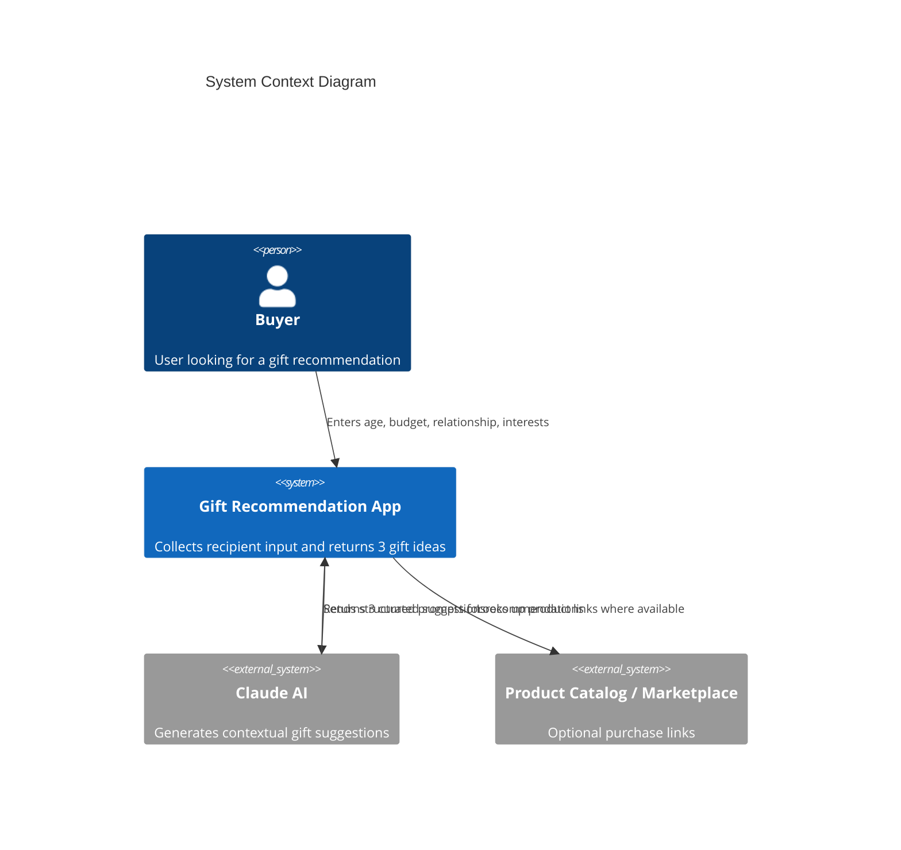
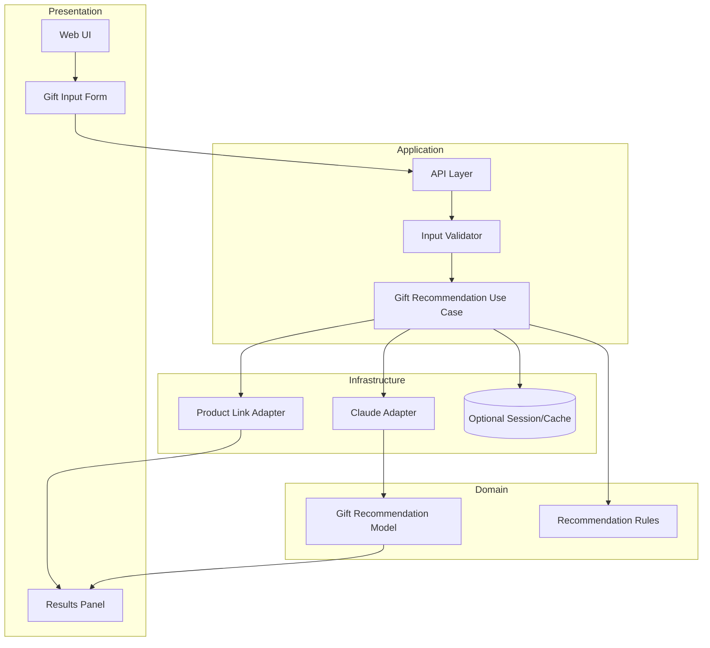
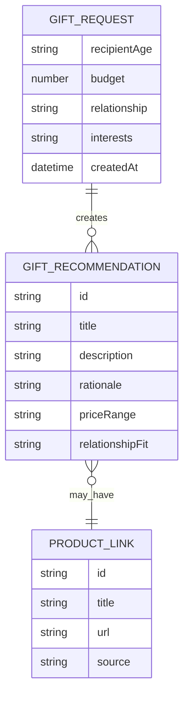

# System Architecture Diagrams - What Gift Should I Choose

## System Context

```mermaid
C4Context
  title System Context Diagram

  Person(user, "Buyer", "User looking for a gift recommendation")
  System(system, "Gift Recommendation App", "Collects recipient input and returns 3 gift ideas")
  System_Ext(ai, "Claude AI", "Generates contextual gift suggestions")
  System_Ext(shop, "Product Catalog / Marketplace", "Optional purchase links")

  Rel(user, system, "Enters age, budget, relationship, interests")
  Rel(system, ai, " Sends structured prompts for recommendations")
  Rel(ai, system, " Returns 3 curated suggestions")
  Rel(system, shop, " Looks up product links where available")
```

## Component Architecture

```mermaid
flowchart TB
  subgraph Presentation
    UI[Web UI]
    Form[Gift Input Form]
    Results[Results Panel]
  end

  subgraph Application
    API[API Layer]
    UseCase[Gift Recommendation Use Case]
    Validator[Input Validator]
  end

  subgraph Domain
    Model[Gift Recommendation Model]
    Rules[Recommendation Rules]
  end

  subgraph Infrastructure
    Adapter[Claude Adapter]
    ProductAdapter[Product Link Adapter]
    Store[(Optional Session/Cache)]
  end

  UI --> Form
  Form --> API
  API --> Validator
  Validator --> UseCase
  UseCase --> Rules
  UseCase --> Adapter
  UseCase --> ProductAdapter
  Adapter --> Model
  ProductAdapter --> Results
  Model --> Results
  UseCase --> Store
```

## Data Model

```mermaid
erDiagram
  GIFT_REQUEST ||--o{ GIFT_RECOMMENDATION : creates
  GIFT_RECOMMENDATION }o--|| PRODUCT_LINK : may_have

  GIFT_REQUEST {
    string recipientAge
    number budget
    string relationship
    string interests
    datetime createdAt
  }

  GIFT_RECOMMENDATION {
    string id
    string title
    string description
    string rationale
    string priceRange
    string relationshipFit
  }

  PRODUCT_LINK {
    string id
    string title
    string url
    string source
  }
```
