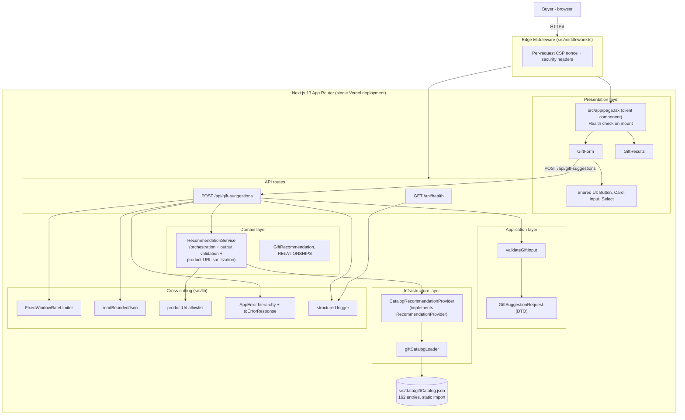

# System Overview Diagrams - What Gift Should I Choose (Current State)

**Source**: `docs/architecture/current/00-system-overview.md`
**Date**: 2026-09-22

---

## System Architecture Diagram

```mermaid
flowchart TB
  User[Buyer - browser]

  subgraph EdgeMiddleware["Edge Middleware (src/middleware.ts)"]
    CSP[Per-request CSP nonce + security headers]
  end

  subgraph NextApp["Next.js 13 App Router (single Vercel deployment)"]
    subgraph Presentation["Presentation layer"]
      Page["src/app/page.tsx (client component)\nHealth check on mount"]
      Form[GiftForm]
      Results[GiftResults]
      UIKit["Shared UI: Button, Card, Input, Select"]
    end

    subgraph API["API routes"]
      HealthRoute["GET /api/health"]
      GiftRoute["POST /api/gift-suggestions"]
    end

    subgraph AppLayer["Application layer"]
      DTO["GiftSuggestionRequest (DTO)"]
      Validate["validateGiftInput"]
    end

    subgraph DomainLayer["Domain layer"]
      RecService["RecommendationService\n(orchestration + output validation +\nproduct-URL sanitization)"]
      Entities["GiftRecommendation, RELATIONSHIPS"]
    end

    subgraph InfraLayer["Infrastructure layer"]
      CatalogProvider["CatalogRecommendationProvider\n(implements RecommendationProvider)"]
      CatalogLoader[giftCatalogLoader]
    end

    subgraph CrossCutting["Cross-cutting (src/lib)"]
      RateLimiter[FixedWindowRateLimiter]
      BodyReader[readBoundedJson]
      ProductUrl["productUrl allowlist"]
      Errors["AppError hierarchy + toErrorResponse"]
      Logger[structured logger]
    end

    Catalog[("src/data/giftCatalog.json\n162 entries, static import")]
  end

  User -->|HTTPS| EdgeMiddleware
  EdgeMiddleware --> Page
  EdgeMiddleware --> API
  Page --> Form
  Page --> Results
  Form --> UIKit
  Form -->|"POST /api/gift-suggestions"| GiftRoute
  GiftRoute --> RateLimiter
  GiftRoute --> BodyReader
  GiftRoute --> Validate
  Validate --> DTO
  GiftRoute --> RecService
  RecService --> CatalogProvider
  RecService --> ProductUrl
  CatalogProvider --> CatalogLoader
  CatalogLoader --> Catalog
  GiftRoute --> Errors
  GiftRoute --> Logger
  HealthRoute --> Logger
```
