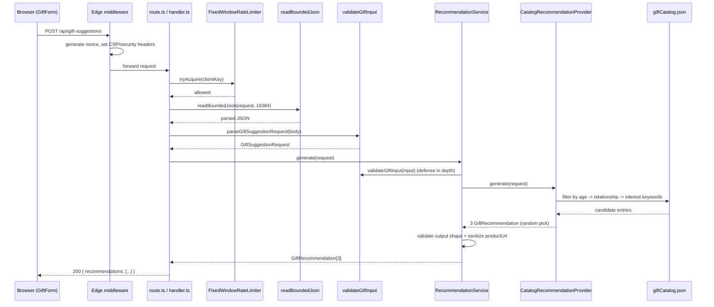
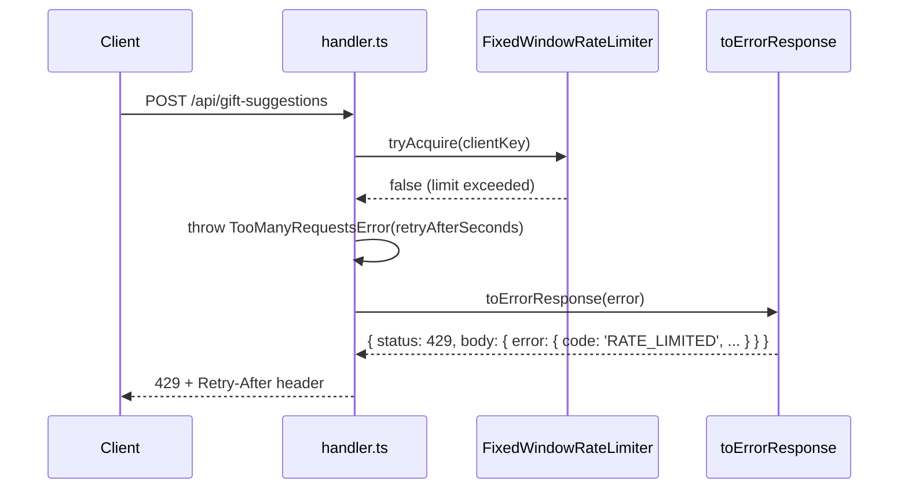
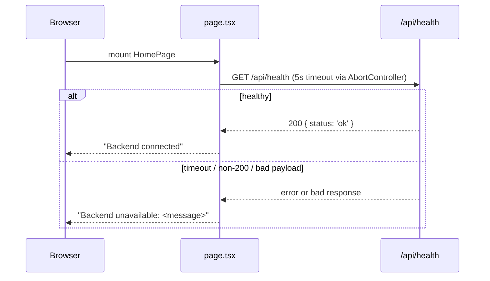

# Full System Deep-Dive Diagrams - What Gift Should I Choose (Current State)

**Source**: `docs/architecture/current/01-full-system-deep-dive.md`
**Date**: 2026-09-22

---

## Workflow: POST /api/gift-suggestions (happy path)

---

## Workflow: POST /api/gift-suggestions (rate-limited / error path)

---

## Workflow: Client-side page load (health check)

