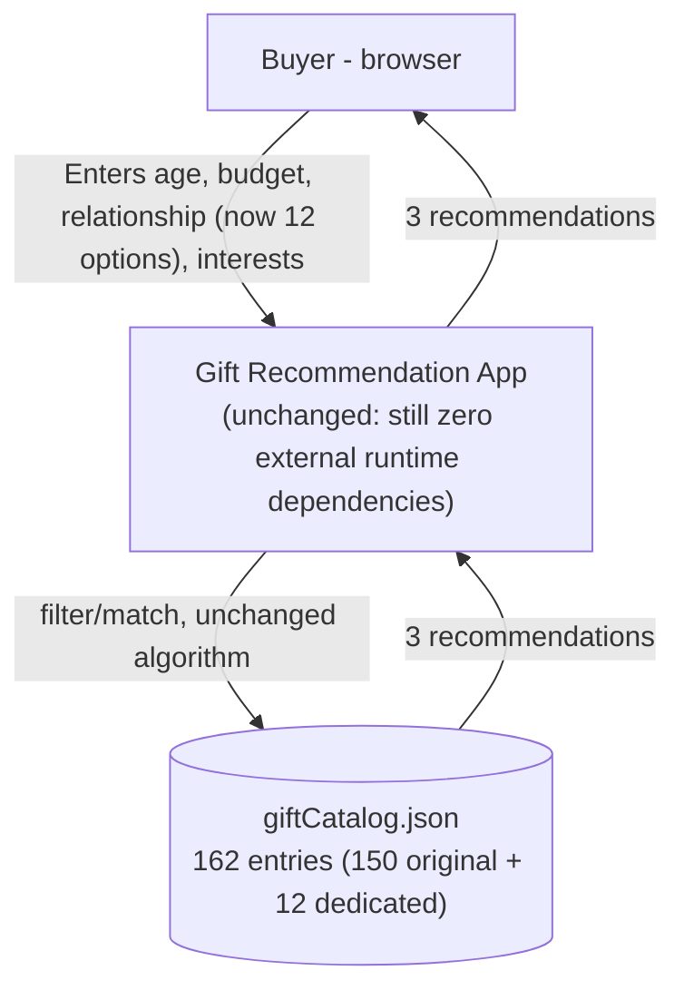
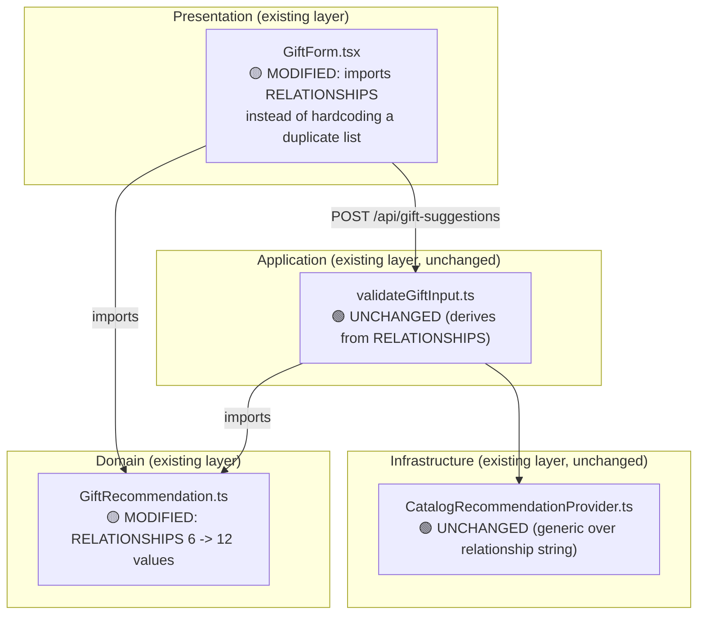

# Target Architecture Diagrams - What Gift Should I Choose

**Source**: `docs/architecture/design/02-target-architecture-brownfield.md`
**Generated**: 2026-09-22

> Mermaid diagrams extracted from the target architecture document for easy preview.

---

## Target System Context Diagram

---

## Component Architecture (Target)

---

## Data Model Changes

_No ER diagram — there is no database. The only data-model change is a compile-time TypeScript union widening (see the target architecture doc's Data Model Changes section for the exact code)._
