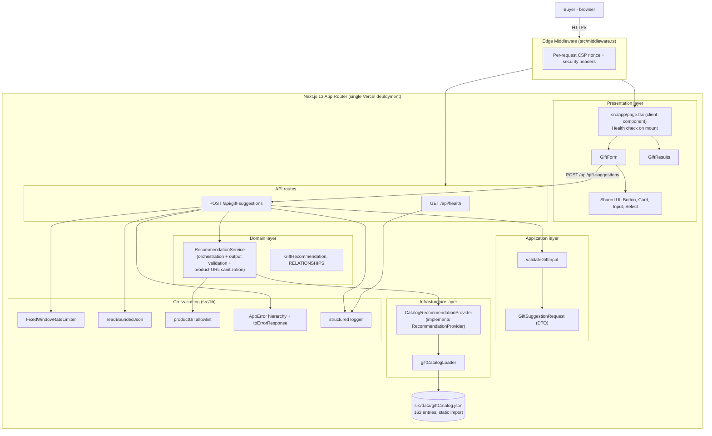

# System Overview - What Gift Should I Choose

**Date**: 2026-09-22
**Analyzed By**: ARCHITECT
**Status**: Draft (pending user confirmation)

---

## Executive Summary

A single-page Next.js app where a buyer enters a recipient's age, budget, relationship, and interests and gets back exactly 3 gift suggestions. Recommendations are produced entirely by matching against a static, bundled 162-entry gift catalog — there is **no external AI/LLM call at runtime**, despite the original design calling for one (see Key Observations).

> **Updated 2026-09-23** (Story 4.1): the catalog grew from 150 to 162 entries when `Gift_Ideas_Database-V1.xlsx` replaced the original spreadsheet, adding 12 entries dedicated to 6 new relationship options (`Mortal Enemy`, `Frenemy`, `Coworker I Tolerate`, `Secret Santa Victim`, `Boss I Need to Impress`, `Person Whose Name I Forgot`) alongside the original 6. The original 150 entries are unchanged.

---

## System Architecture

### Architecture Diagram

### Architecture Style

**Layered monolith**, single Next.js 13 App Router application, deployed as-is to Vercel (serverless functions + edge middleware). Internally organized as Clean-Architecture-style layers: `domain` → `application` → `infrastructure`, with `app`/`components` as the presentation layer and `lib` as cross-cutting concerns. No separate backend service, no database.

---

## Technology Stack

| Category | Technology | Version | Notes |
|----------|------------|---------|-------|
| Framework | Next.js (App Router) | 13.5.11 | ⚠️ Known high/critical CVEs at this version — see Areas of Concern |
| UI | React / react-dom | 18.2.0 | |
| Language | TypeScript | 5.3.3 | strict app code under `src/` |
| Styling | Plain CSS | — | `src/app/globals.css`, Google Fonts (DM Sans, Fraunces) via `next/font` |
| Testing | Vitest | 0.34.6 | `environment: node`, jsdom only for one interaction test file |
| Testing utils | @testing-library/react, jest-dom, user-event | ^14.x / ^6.x | |
| Coverage | @vitest/coverage-v8 + custom `scripts/check-coverage.mjs` | — | Native vitest 0.34.6 `--coverage.thresholds.*` verified NOT to fail the build; a custom script reads the json-summary report instead |
| Lint | ESLint (`eslint-config-next`) | 8.56.0 / 13.5.11 | |
| Hosting | Vercel | — | Confirmed target; no Terraform/IaC in this repo |
| CI | GitHub Actions | — | `.github/workflows/ci.yml`, `codeql.yml`, `dependabot.yml` |
| Database | **None** | — | No DB, cache, or queue anywhere in the codebase |
| External services | **None at runtime** | — | No outbound API calls in application code; catalog is a bundled static JSON file |

---

## Module Overview

| Module | Path | Responsibility | Depends on |
|--------|------|----------------|------------|
| Presentation (pages) | `src/app/page.tsx`, `src/app/layout.tsx` | Renders the form/results shell; client-side health check on mount; forces dynamic rendering so the CSP nonce is per-request | `components/forms`, `components/results` |
| Presentation (components) | `src/components/forms/GiftForm.tsx`, `src/components/results/GiftResults.tsx`, `src/components/shared/{Button,Card,Input,Select}.tsx` | Form UI, result cards, shared primitives | — |
| Edge middleware | `src/middleware.ts` | Generates a per-request CSP nonce, sets CSP/HSTS/X-Frame-Options/etc. on both the forwarded request and the response, for every non-static route | — |
| API routes | `src/app/api/gift-suggestions/{route,handler,schema}.ts`, `src/app/api/health/route.ts` | HTTP entry points: rate limiting, bounded body read, request-id/logging, error-to-HTTP-response mapping | Application, Domain, Infrastructure, `lib` |
| Application | `src/application/dto/GiftSuggestionRequest.ts`, `src/application/validation/validateGiftInput.ts` | Input DTO + strict validation (rejects unknown fields, bad types, out-of-range values) | Domain entities, `lib/errors` |
| Domain | `src/domain/entities/GiftRecommendation.ts`, `src/domain/services/RecommendationService.ts` | Core types (`RELATIONSHIPS`, `GiftRecommendation`) and the `RecommendationService` that validates input, calls the provider, validates provider output shape, and sanitizes `productUrl` against a trusted-domain allowlist | `application`, `lib/errors`, `lib/productUrl` |
| Infrastructure | `src/infrastructure/catalog/{CatalogRecommendationProvider,giftCatalogLoader}.ts` | Implements `RecommendationProvider` against the static catalog: age filter → relationship filter → interest keyword match (with fallback) → random pick of 3 | `src/data/giftCatalog.json`, Domain interface |
| Cross-cutting (`lib`) | `errors.ts`, `logger.ts`, `rateLimiter.ts`, `requestBody.ts`, `productUrl.ts`, `health-handler.ts` | Typed error hierarchy + HTTP mapping, structured logger, fixed-window rate limiter (+ an unused `ConcurrencyLimiter` left over from the AI-provider era), bounded JSON body reader, trusted-URL allowlist, health-check handler | — |
| Data | `src/data/giftCatalog.json` (162 entries) | Static, build-time-bundled gift catalog, generated by `scripts/convert-gift-catalog.py` from `Gift_Ideas_Database-V1.xlsx` (originally `Gift_Ideas_Database.xlsx`, 150 entries; superseded 2026-09-23) | Not read at runtime from disk — imported as a module |

---

## Entry Points

| Type | Path | Description |
|------|------|--------------|
| HTTP (page) | `src/app/page.tsx` | Single-page UI; `dynamic = 'force-dynamic'` in `layout.tsx` so every response gets its own CSP nonce |
| HTTP (API) | `POST /api/gift-suggestions` → `src/app/api/gift-suggestions/route.ts` → `handler.ts` | Rate-limited (10 req/60s per client key), 16 KB body cap, returns exactly 3 recommendations or a typed error |
| HTTP (API) | `GET /api/health` → `src/app/api/health/route.ts` → `src/lib/health-handler.ts` | Liveness check; polled client-side on page load |
| Edge middleware | `src/middleware.ts` | Runs on every request except `_next/static`, `_next/image`, `favicon.ico` |

---

## External Dependencies

### NPM Packages (Key)
| Package | Purpose |
|---------|---------|
| next | Framework (App Router, edge middleware, `next/font`) |
| react / react-dom | UI |
| vitest / @testing-library/* / jsdom | Testing |

### External Services
**None.** The Epic 3 rewrite removed the previous Claude AI dependency entirely (see Key Observations). The only external network calls possible from application code are recommended *product links* (`productUrl`), which are never fetched server-side — only validated against an allowlist (default `amazon.com`) and passed through to the client to render as `<a>` links.

---

## Design References (Legacy Documentation)

**Location**: `SPEC/references/` (`builds/`, `devops/` subfolders — both empty; no legacy PRD/architecture/design files exist there)

`docs/helix/INDEX.md` (synced 2026-09-22) was also checked: the connected Helix solution (`GiftSugestionApp`, id 1024) currently has **zero solution documents**, so there was no additional Helix-side reference content to incorporate.

| File | Type | Description | Relevance |
|------|------|-------------|-----------|
| `docs/architecture/design/00-system-architecture-greenfield.md` | Prior design (not `SPEC/references/`, but load-bearing) | Original greenfield design (2026-09-16) specifying a Claude-AI-based recommendation engine | **Stale** — superseded by Epic 3; kept for history only |
| `docs/requirements.md` | Requirements | Amended 2026-09-18 for catalog-based matching | Reflects current intent |
| `Gift_Ideas_Database-V1.xlsx` | Source data | 162-entry spreadsheet, current source of truth for `giftCatalog.json` (supersedes the original `Gift_Ideas_Database.xlsx`, 150 entries, 2026-09-23) | Data provenance |

---

## Test Infrastructure

| Type | Location | Framework | Coverage (per `docs/status.md`, 2026-09-18) |
|------|----------|-----------|------|
| Unit + component | `src/tests/*.test.ts(x)` (16 files) | Vitest 0.34.6 + Testing Library (jsdom only for `gift-form-interactions.test.tsx`; `node` env otherwise) | 96.47% stmts, 128/128 tests passing |
| Coverage gate | `scripts/check-coverage.mjs` | Reads `coverage/coverage-summary.json` directly | Wired into CI because native `--coverage.thresholds.*` was verified not to fail the build on this vitest version |

---

## Configuration

| File / Var | Purpose |
|------|---------|
| `.env.example` → `TRUSTED_PRODUCT_DOMAINS` | Comma-separated allowlist for outbound product links (defaults to `amazon.com` if unset) |
| No other env vars | Confirmed: no DB URL, no API keys — the app has zero required production secrets (`docs/deployment/pipeline-secrets.md`) |
| `vitest.config.ts` | Test environment, path alias `@` → `src`, coverage config |
| `tsconfig.json` | TS compiler config |
| No `next.config.js` | Project uses Next.js defaults entirely |

---

## Key Observations

### Strengths
- Clean layering (domain/application/infrastructure/presentation) is consistently followed and independently testable — e.g., `RecommendationService` depends only on the `RecommendationProvider` interface, not the concrete catalog implementation.
- Meaningful security surface for an MVP: per-request CSP nonce, HSTS, rate limiting, bounded request bodies, and an explicit trusted-domain allowlist for any URL shown to the user.
- High, verified test coverage (96.47%) with a coverage gate that was empirically checked to actually fail builds (the default vitest mechanism was checked and found not to).

### Areas of Concern
- **Design/code drift**: `docs/architecture/design/00-system-architecture-greenfield.md` still describes a Claude-AI-based recommendation engine with an "AI Integration" layer — that entire subsystem (`src/infrastructure/ai/`, `ClaudeRecommendationClient.ts`) was deleted in Epic 3 and replaced by static catalog matching. Anyone reading the design doc without cross-checking the code would materially misunderstand how recommendations are produced today. Recommend either updating the design doc or explicitly marking it superseded, pointing to this current-state doc.
- **`next@13.5.11` has known high/critical CVEs** (unauthenticated RCE, SSRF, cache poisoning, auth bypass per `docs/status.md`); fixing requires a major 13→16 upgrade. This is a tracked, user-accepted open blocker (`NEXTJS-CVE`), not yet remediated.
- **Rate limiter is in-memory/per-process** (`FixedWindowRateLimiter`, a plain `Map`), so it does not hold correctly across multiple serverless instances on Vercel — a known, accepted MVP limitation, not a defect introduced by this analysis.
- Dead code: `ConcurrencyLimiter` in `src/lib/rateLimiter.ts` appears to be an unused leftover from the retired AI-provider adapter (no call sites found) — the catalog provider is synchronous-fast and has no concurrency concern.

### Technical Debt
- `next` major-version upgrade (13→16) — deferred, tracked in `docs/status.md` Upcoming/Blockers.
- Reconcile or retire the stale `docs/architecture/design/` doc against actual (catalog-based) implementation.
- Confirm whether `ConcurrencyLimiter` should be deleted along with its now-orphaned purpose.
