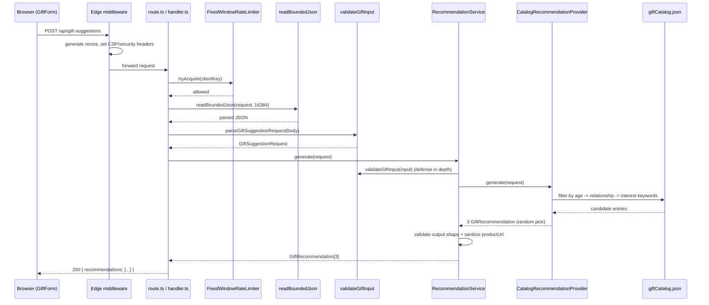
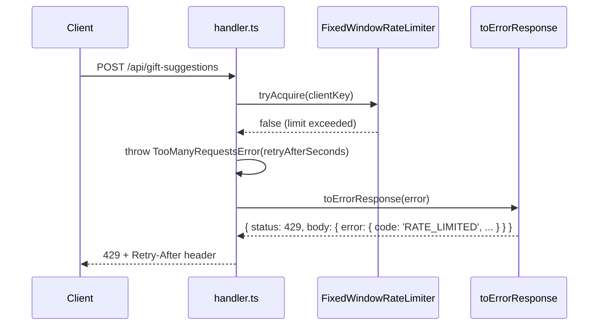
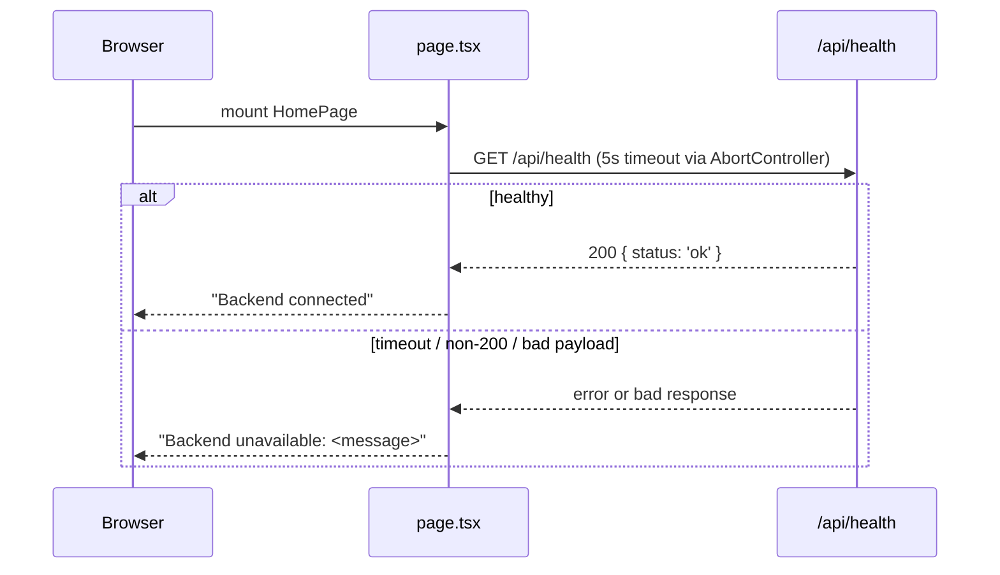

# Deep-Dive - Full System

**Date**: 2026-09-22
**Analyzed By**: ARCHITECT
**Status**: Draft (pending user confirmation)
**Scope**: Full system (all layers) — presentation, API, application, domain, infrastructure/catalog, cross-cutting `lib`

---

## Module Overview

**Purpose**: Single-page app that takes a recipient's age, budget, relationship, and interests, and returns exactly 3 gift suggestions matched against a static, bundled catalog. No external AI/API dependency.
**Path**: `src/`
**Key Files**: 28 non-test TypeScript/TSX files (excluding `.DS_Store`, JSON data), 16 test files, ~2,000 LOC across `src/` (excluding `node_modules`, generated files)

---

## Component Breakdown

| Component | File | Responsibility |
|-----------|------|-----------------|
| Edge middleware | `src/middleware.ts` | Per-request CSP nonce generation + security headers on every non-static route |
| Page shell | `src/app/layout.tsx` | Root HTML, fonts, forces `dynamic = 'force-dynamic'` so the CSP nonce is fresh per request |
| Home page | `src/app/page.tsx` | Client component; runs a health check on mount; renders `GiftForm` |
| Form UI | `src/components/forms/GiftForm.tsx` | Client-side form state, client-side pre-validation (reuses `validateGiftInput`), calls the API, renders `GiftResults` |
| Results UI | `src/components/results/GiftResults.tsx` | Renders loading/error/empty/3-result states; type-guards the API response shape; only renders `productUrl` as a link if `isTrustedProductUrl` passes |
| Shared UI | `src/components/shared/{Button,Card,Input,Select}.tsx` | Presentational primitives, no business logic |
| API route (gift) | `src/app/api/gift-suggestions/route.ts` | Thin Next.js route — delegates `POST` to `createGiftSuggestionsHandler()` |
| API handler (gift) | `src/app/api/gift-suggestions/handler.ts` | Orchestrates: request-id, rate limit check, bounded body read, parse/validate, call `RecommendationService`, map result/errors to `NextResponse` |
| API schema (gift) | `src/app/api/gift-suggestions/schema.ts` | Thin wrapper around `validateGiftInput` (kept as a separate module for the route's parse step) |
| API route (health) | `src/app/api/health/route.ts` | Delegates `GET` to `createHealthHandler()` |
| Health handler | `src/lib/health-handler.ts` | Logs the check, returns `{ status: 'ok' }` or a mapped error |
| DTO | `src/application/dto/GiftSuggestionRequest.ts` | `{ recipientAge, budget, relationship, interests }` — the validated shape passed between layers |
| Validation | `src/application/validation/validateGiftInput.ts` | Strict, allowlist-based input validation (rejects unknown fields; bounds-checks age/budget/interests length; enforces the `RELATIONSHIPS` enum) |
| Domain entities | `src/domain/entities/GiftRecommendation.ts` | `RELATIONSHIPS` const tuple + `Relationship` type; `GiftRecommendation` / `GiftRecommendationResponse` types |
| Domain service | `src/domain/services/RecommendationService.ts` | Orchestrates: validate input → call `RecommendationProvider` → validate provider output shape (exactly 3, all required string fields) → sanitize `productUrl` via the trusted-domain allowlist |
| Infrastructure provider | `src/infrastructure/catalog/CatalogRecommendationProvider.ts` | Implements `RecommendationProvider`; the actual matching algorithm (see Key Workflows) |
| Infrastructure loader | `src/infrastructure/catalog/giftCatalogLoader.ts` | Static-imports `src/data/giftCatalog.json`, typed as `GiftCatalogEntry[]` |
| Data | `src/data/giftCatalog.json` | 162 static catalog entries (150 original + 12 added for the new relationship options in Story 4.1), generated by `scripts/convert-gift-catalog.py` |
| Errors | `src/lib/errors.ts` | `AppError` hierarchy (`ValidationError`, `RecommendationServiceError`, `RecommendationProviderError`, `TooManyRequestsError`, `PayloadTooLargeError`) + `toErrorResponse()` |
| Logger | `src/lib/logger.ts` | Structured JSON stdout logger; auto-redacts keys matching `password/secret/token/api[-_]?key/authorization/cookie` |
| Rate limiter | `src/lib/rateLimiter.ts` | `FixedWindowRateLimiter` (in use) + `ConcurrencyLimiter` (defined, **no call sites found** — orphaned from the retired AI-provider adapter) |
| Body reader | `src/lib/requestBody.ts` | Streams the request body with an early Content-Length check and a running byte-count check, throwing `PayloadTooLargeError` before parsing |
| Product URL | `src/lib/productUrl.ts` | `isTrustedProductUrl` / `resolveTrustedProductDomains` — HTTPS + domain-allowlist check, used both server-side (sanitization) and client-side (render gate) |

---

## Key Workflows

### Workflow: POST /api/gift-suggestions (happy path)



**Stories** (per `docs/plans/stories/`): Story 3.1 (catalog data model), Story 3.2 (matching service), Story 3.3 (wire in provider, retire AI adapter).

### Workflow: POST /api/gift-suggestions (rate-limited / error path)



Every other failure path (`ValidationError` → 400, `PayloadTooLargeError` → 413, `RecommendationServiceError` → 500/other) follows the same shape: throw a typed `AppError` subclass, catch once at the handler boundary, map via `toErrorResponse`. No error path returns a raw stack trace or unmapped 500 body.

### Workflow: Client-side page load (health check)



---

## Data Models

There is **no database**. The only structured data is the bundled catalog and the request/response DTOs.

### "Entity": GiftCatalogEntry (static JSON, `src/data/giftCatalog.json`, 162 rows)

| Field | Type | Constraints | Description |
|-------|------|-------------|-------------|
| giftId | string | unique (source-verified) | Stable ID, e.g. `G001` |
| name | string | required | Gift title |
| description | string | required | Shown to the user |
| interestCategory | string | required | Primary interest bucket, e.g. `Sports` |
| keywords | string[] | required | Extra matchable terms |
| minRecipientAge / maxRecipientAge | number | inclusive range | Age eligibility |
| relationshipTags | string[] | `RELATIONSHIPS` values or `"All"` | Relationship eligibility |
| priceRangeUsd | string | required | Display-only price band, e.g. `"$40-$80"` |

### DTO: GiftSuggestionRequest (`src/application/dto/`)

| Field | Type | Notes |
|-------|------|-------|
| recipientAge | number | integer ≥ 0 |
| budget | number | > 0; **validated but never used for matching** (documented, intentional — matches the source spreadsheet's own algorithm) |
| relationship | `Relationship` | one of `RELATIONSHIPS` — 12 values as of Story 4.1: `Friend, Partner, Parent, Child, Sibling, Colleague, Mortal Enemy, Frenemy, Coworker I Tolerate, Secret Santa Victim, Boss I Need to Impress, Person Whose Name I Forgot` |
| interests | string | 1–500 chars |

### Type: GiftRecommendation (`src/domain/entities/`)

| Field | Type | Notes |
|-------|------|-------|
| id, title, description, rationale, priceRange, relationshipFit | string | all required, non-empty |
| productUrl | string? | optional; stripped by `RecommendationService` unless it passes `isTrustedProductUrl` (https + allowlisted domain, default `amazon.com`) |

---

## Pattern Catalog

### Error Handling

**Pattern**: A single `AppError` base class with subclasses carrying `statusCode` + `code`; every route catches once at its outer boundary and maps via `toErrorResponse`.

**Example (from `src/lib/errors.ts` + `src/app/api/gift-suggestions/handler.ts`)**:
```typescript
// DO: throw a typed AppError subclass, let the boundary map it
throw new TooManyRequestsError(rateLimiter.retryAfterSeconds(clientKey));
// ...
} catch (error) {
  const response = toErrorResponse(error);
  return NextResponse.json(response.body, { status: response.status });
}

// DON'T: throw/return raw Error or ad-hoc response shapes inside a route
```

### Logging

**Pattern**: Structured JSON to stdout, one `Logger` interface, context object first, message second; sensitive keys auto-redacted by pattern match rather than by caller discipline.

**Example (from `src/lib/logger.ts` + `handler.ts`)**:
```typescript
// DO: structured context, then message
logger.warn({ requestId, clientKey }, 'Gift recommendations request rate-limited');

// DON'T: string-interpolate context into the message
logger.warn(`Rate limited: ${clientKey}`);
```

### "Data" Access (no DB — static catalog + dependency-injected provider)

**Pattern**: The domain layer depends only on the `RecommendationProvider` interface; the concrete `CatalogRecommendationProvider` is injected via a default constructor parameter, never imported directly by `RecommendationService`.

**Example (from `RecommendationService.ts` + `CatalogRecommendationProvider.ts`)**:
```typescript
// DO: depend on the interface
export interface RecommendationProvider {
  generate(input: GiftSuggestionRequest): Promise<unknown>;
}
export class RecommendationService {
  constructor(private readonly provider: RecommendationProvider, ...) {}
}

// DON'T: import CatalogRecommendationProvider directly inside RecommendationService
```
This same injection pattern repeats for `logger`, `rateLimiter`, `createRequestId`, and `resolveClientKey` in `createGiftSuggestionsHandler` — every handler is a factory function taking an optional dependencies object with defaults, which is also what makes each one trivially testable without mocking modules.

### API Response Pattern

**Pattern**: Success is always `{ recommendations: GiftRecommendation[] }` (exactly 3 entries) or `{ status: 'ok' }` for health; failure is always `{ error: { code, message } }` with a matching HTTP status. `RecommendationService` re-validates the shape coming back from *any* provider before it reaches the route — the boundary doesn't trust its own infrastructure layer blindly.

### Naming Conventions

- Files: `PascalCase.ts(x)` for classes/components (`RecommendationService.ts`, `CatalogRecommendationProvider.ts`, `GiftForm.tsx`), `camelCase.ts` for pure function modules (`validateGiftInput.ts`, `giftCatalogLoader.ts`, `productUrl.ts`).
- Errors: always suffixed `Error` and extending `AppError`.
- Factories: `create*` prefix for handler/logger factories (`createGiftSuggestionsHandler`, `createHealthHandler`, `createLogger`).
- Type guards: `is*` prefix (`isTrustedProductUrl`, `isGiftRecommendationResponse`, `isAgeEligible`, `isRelationshipEligible`).

### Testing Patterns

**Location**: `src/tests/*.test.ts(x)` (16 files, colocated under one folder rather than beside sources)
**Framework**: Vitest + `@testing-library/react` (jsdom only for `gift-form-interactions.test.tsx`; `node` env for everything else — set per-file in `vitest.config.ts`'s `environmentMatchGlobs`)
**Pattern**: dependency injection over module mocking — tests construct handlers/services with explicit fake collaborators (a fake `RecommendationProvider`, a dedicated `FixedWindowRateLimiter` instance) instead of `vi.mock()`-ing modules, per the DI pattern noted above.

**Example (from `src/tests/gift-suggestions-api.test.ts`)**:
```typescript
// DO: inject a fake provider + a generous dedicated rate limiter
function createTestHandler(overrides = {}) {
  return createGiftSuggestionsHandler({
    rateLimiter: new FixedWindowRateLimiter(1_000, 60_000),
    ...overrides,
  });
}
const provider = { generate: vi.fn().mockResolvedValue(recommendations()) };
const service = new RecommendationService(provider);
await expect(service.generate(validInput)).resolves.toHaveLength(3);
```

---

## Entry Points

| Entry | Path | Method | Description |
|-------|------|--------|-------------|
| Gift suggestions | `/api/gift-suggestions` | POST | Rate-limited (10/60s per client key), 16 KB body cap, returns exactly 3 recommendations |
| Health | `/api/health` | GET | Liveness probe, polled by the client on page load |
| Home page | `/` | GET (page) | Renders the form; `force-dynamic` for per-request CSP nonce |
| Edge middleware | (all routes except `_next/static`, `_next/image`, `favicon.ico`) | — | CSP nonce + security headers |

---

## Recommendations

1. **Reconcile the design doc**: `docs/architecture/design/00-system-architecture-greenfield.md` still documents the retired Claude-AI engine. Update it or mark it superseded so it doesn't mislead future readers (already flagged in the system overview).
2. **Remove or repurpose `ConcurrencyLimiter`** (`src/lib/rateLimiter.ts`) — no call sites found anywhere in `src/`; it appears to be dead code left over from the AI-provider adapter retired in Epic 3.
3. **`next@13.5.11` CVE upgrade** remains open (tracked in `docs/status.md` as `NEXTJS-CVE`) — not a new finding, but directly relevant to any future architecture/requirements work on this codebase.
4. The DI-via-default-parameter pattern used throughout (`createGiftSuggestionsHandler`, `createHealthHandler`, `RecommendationService`, `CatalogRecommendationProvider`) is consistent and test-friendly — worth calling out explicitly as the standard to follow in any patterns/standards doc for future brownfield work.
