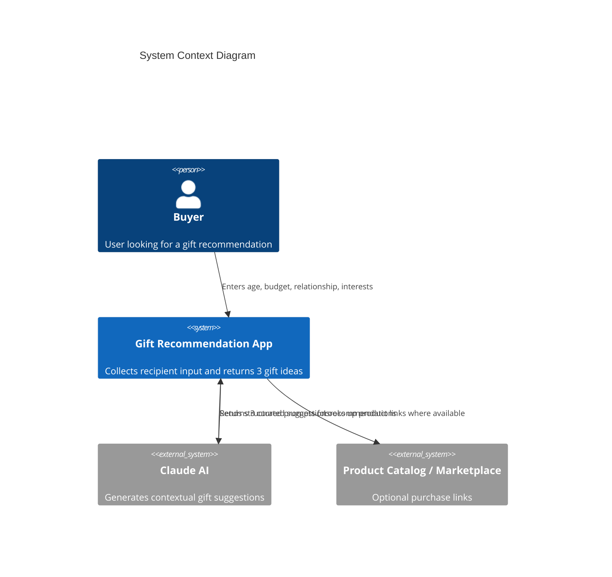
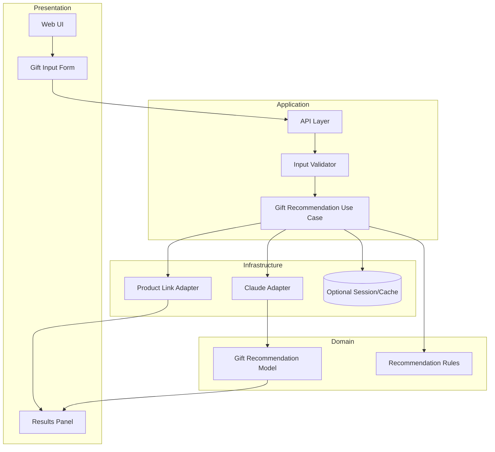
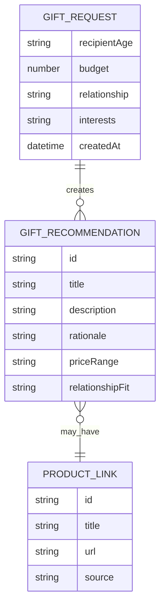

# System Architecture - What Gift Should I Choose

**Date**: 2026-09-16  
**Author**: ARCHITECT  
**Status**: Approved  
**Version**: 1.0

---

## Overview

### Purpose
Provide a lightweight web experience where a buyer enters a recipient's age, budget, relationship, and interests, and receives exactly three tailored gift suggestions.

### Architecture Style
Layered monolith with a simple web front end and a single backend service. This is the best fit for an MVP because it minimizes operational complexity while keeping a clean separation between UI, application logic, and AI integration.

### Key Drivers
- Users need a fast, single-page recommendation flow.
- The system must generate exactly three gift ideas from structured inputs.
- AI recommendation logic must be isolated from the web layer.
- Product lookups and LLM calls should be easy to test and replace.

---

## Technology Stack

| Category | Technology | Version | Justification |
|----------|------------|---------|---------------|
| Frontend | Next.js | Latest stable | Fast setup for interactive UI and simple deployment |
| Backend | Node.js + TypeScript | Latest LTS | Strong API ergonomics and easy AI integration |
| API Layer | REST | N/A | Simple contract for a single feature MVP |
| Domain Logic | TypeScript modules | N/A | Keeps business rules typed and testable |
| AI Integration | Claude API client | Current provider SDK | Matches the project requirement to use Claude |
| Product Lookup | Optional web search / product catalog adapter | N/A | Enables purchase suggestions without introducing a full marketplace |
| Persistence | SQLite / file-backed store (optional MVP) | N/A | No multi-user state required; keeps the MVP lightweight |
| Hosting | Vercel or equivalent | N/A | Simple deployment for web app and API |
| Testing | Vitest + RTL | Current | Good unit and UI coverage for the recommendation flow |

---

## System Context



---

## Component Architecture



---

## Data Model



---

## API Contracts

### POST /api/gift-suggestions

#### Request
```json
{
  "recipientAge": 28,
  "budget": 75,
  "relationship": "Friend",
  "interests": "coffee, hiking, books"
}
```

#### Success Response
```json
{
  "recommendations": [
    {
      "title": "Personalized Coffee Gift Set",
      "description": "A premium coffee kit suited to someone who enjoys café culture and cozy routines.",
      "rationale": "Matches the user's love of coffee and a friendly budget-friendly gift style.",
      "priceRange": "$50-$80",
      "productUrl": "https://example.com/product/coffee-set"
    },
    {
      "title": "Trail Journal & Water Bottle",
      "description": "A practical gift for outdoor enthusiasts.",
      "rationale": "Works well for someone who enjoys hiking and active weekends.",
      "priceRange": "$40-$70",
      "productUrl": "https://example.com/product/hiking-kit"
    },
    {
      "title": "Bookstore Gift Card",
      "description": "A flexible option for a reader who likes thoughtful, low-friction gifts.",
      "rationale": "Helpful for a book lover with a general interest in reading.",
      "priceRange": "$25-$60",
      "productUrl": "https://example.com/product/book-card"
    }
  ]
}
```

#### Error Responses
- 400: Invalid request body or missing fields
- 422: Unsupported relationship value
- 429: Rate limit exceeded from external AI provider
- 500: Recommendation generation failure

---

## Security Design

### Authentication and Authorization
- No authenticated user account is required for the MVP.
- The system has a single buyer persona and no admin or multi-user access model in the current scope.
- Role names align to the canonical matrix in `docs/requirements.md`: Buyer and System/Service.

### Data Protection
- User input is treated as untrusted data and validated on the server.
- API keys for Claude and any marketplace integration are stored only on the server side.
- Input is sanitized before being passed to the AI provider.
- No long-term storage of sensitive personal data is required for the MVP.

### Security Boundaries
- Web UI never has direct access to secrets.
- The backend owns all external API calls.
- Product lookup and recommendation generation are isolated behind service interfaces.

---

## Error Handling

### Error Categories
- Validation errors: missing or invalid age/budget/relationship/interests values
- External dependency failures: AI provider outage or rate limit
- Presentation issues: malformed recommendation payload or empty result set

### Response Strategy
- Return structured validation errors with clear messages.
- Fail gracefully with a user-friendly message when the AI service is unavailable.
- Retry transient AI failures with bounded retry logic.
- Avoid returning partial results if the response is malformed or incomplete.

---

## Observability

### Logging
- Log request metadata: request ID, relationship, budget range, and timestamp.
- Log external API call start/end status and failure reasons.
- Log invalid input submissions for product tuning and bug fixing.

### Metrics
- Total recommendations requested
- Recommendation generation latency
- AI provider success/failure rate
- Validation failure count

### Alerting
- Alert on repeated AI failures or elevated latency.
- Alert on anomalous invalid input volumes.

---

## Decision Records

### Decision 1: Use a layered monolith rather than microservices
- Rationale: The project is a single-user MVP with a small feature set. A monolith avoids unnecessary deployment and coordination complexity.

### Decision 2: Keep AI integration behind an adapter layer
- Rationale: The provider may change later; isolating the provider behind an interface keeps the rest of the application stable.

### Decision 3: Treat the recommendation engine as a server-side concern
- Rationale: The AI prompt, provider key, and validation logic must not be exposed to the client.

### Decision 4: Keep product lookup optional
- Rationale: The requirement focuses on generating gift ideas; product links can be added later without changing the core recommendation flow.

---

## Open Questions / Assumptions

- The project will operate as a single-user app without login.
- The climate of recommended gifts can be driven by prompts and lightweight heuristics.
- Product links are optional but preferred when available.

---

## Approval

This architecture is intended to support the MVP requirement of entering age, budget, relationship, and interests to receive three suitable gift suggestions.
