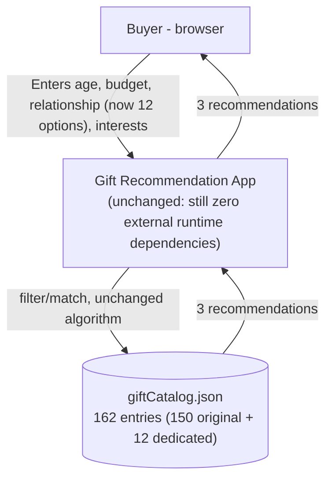
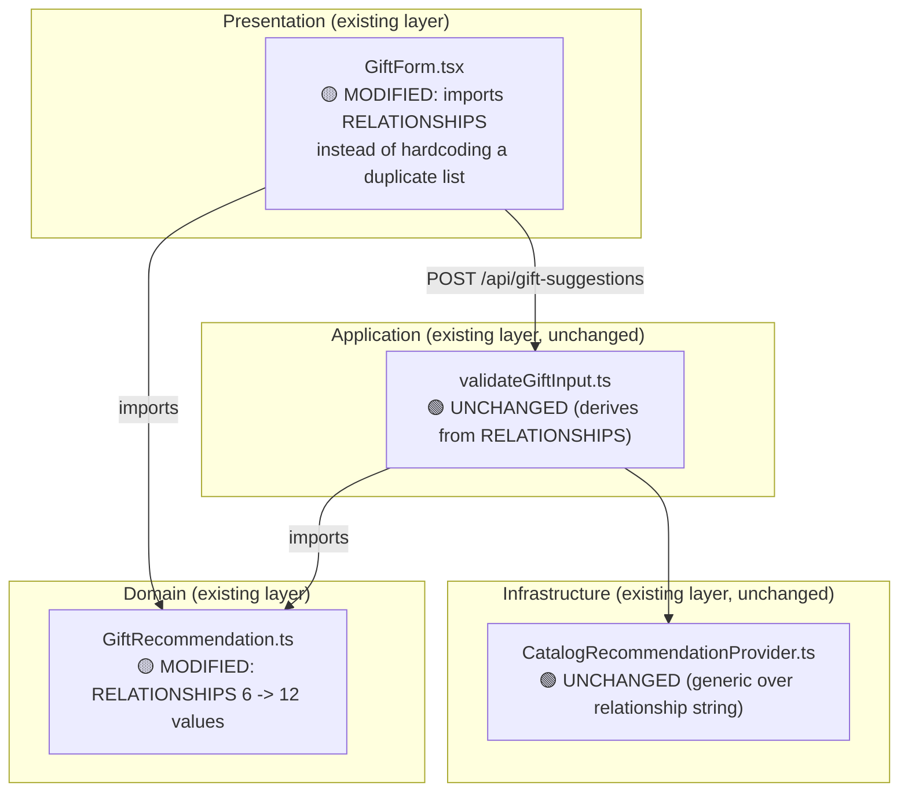

# Target Architecture - What Gift Should I Choose

**Date**: 2026-09-22
**Author**: ARCHITECT
**Status**: Approved — implemented in Story 4.1 (see reconciliation note below)
**Version**: 1.1
**Based On**: `docs/architecture/current/00-system-overview.md`, `docs/architecture/current/01-full-system-deep-dive.md`, `docs/requirements.md` (v1.2)

> ## 📝 Reconciliation Note — 2026-09-23
> The "no catalog changes" decision below (Delta Summary row for `giftCatalog.json`, and the first Technical Decision) was made against the best information available at design time — the catalog then had 150 entries, 75 tagged `"All"`. Before implementation began, the user supplied an updated source spreadsheet (`Gift_Ideas_Database-V1.xlsx`) that already adds 12 dedicated entries tagged for the 6 new relationships (162 entries total; the original 150 are unchanged). This is a strict improvement — additive, no regressions — and required no code change beyond regenerating `src/data/giftCatalog.json`. The original decision text is kept below (struck through, not deleted) for the historical record, per this project's amendment convention. See `docs/requirements.md` (v1.2), `docs/stories-implemented/story-4.1-review.md`, and `docs/reviews/story-4.1-code-review-v1.md` for the full trail.

---

## Overview

### Current System

A layered-monolith Next.js 13 app (domain/application/infrastructure/presentation) with no database. Recommendations are produced by matching structured user input (age, budget, relationship, interests) against a static, bundled 150-entry gift catalog — no external AI dependency.

### What We Are Changing

Requirements v1.1 adds 6 new `relationship` values (`Mortal Enemy`, `Frenemy`, `Coworker I Tolerate`, `Secret Santa Victim`, `Boss I Need to Impress`, `Person Whose Name I Forgot`) alongside the existing 6, and requires eliminating a hardcoded duplicate of the relationship list found in `GiftForm.tsx` during the deep-dive.

### Architecture Approach

**Same architecture style, no new components, no new layers.** This is a same-layer, additive data change: extend the existing canonical `RELATIONSHIPS` constant in the domain layer and make the one presentation-layer consumer that had drifted from it (`GiftForm.tsx`) import from that canonical source instead of duplicating it. No new technology, no new external integration, no data-layer (catalog) changes.

---

## Delta Summary

| Component | Status | Change Description |
|-----------|--------|---------------------|
| `src/domain/entities/GiftRecommendation.ts` | 🟡 Modified | `RELATIONSHIPS` tuple: 6 → 12 values (append 6 new, in order) |
| `src/components/forms/GiftForm.tsx` | 🟡 Modified | Remove hardcoded `relationships` array; import `RELATIONSHIPS` from the domain entity instead — closes the drift risk flagged in the deep-dive |
| `src/application/validation/validateGiftInput.ts` | 🟢 Unchanged | Already derives its accepted set and error message from `RELATIONSHIPS` — automatically covers the 12 values with no code change |
| `src/infrastructure/catalog/CatalogRecommendationProvider.ts` | 🟢 Unchanged | Relationship filter already checks `entry.relationshipTags.includes('All') \|\| entry.relationshipTags.includes(relationship)` — generic over any string value, no code change needed |
| `src/data/giftCatalog.json` | ~~🟢 Unchanged~~ 🟡 Modified (superseded — see Reconciliation Note) | ~~Per requirements v1.1 (explicit decision): no new relationship tags/entries added — the 75 existing `"All"`-tagged entries (of 150) already provide relationship-eligible candidates for any relationship value~~ **Actual**: regenerated from `Gift_Ideas_Database-V1.xlsx` (150 → 162 entries, additive-only) before implementation began — 12 dedicated entries now exist for the 6 new relationships, in addition to the `"All"`-tag fallback |
| `src/lib/logger.ts`, `src/lib/errors.ts`, API routes, middleware | 🟢 Unchanged | Already generic over the relationship string; no schema/contract dependent on the specific 6 values |
| Tests (`src/tests/gift-form.test.tsx`, `gift-form-interactions.test.tsx`, `gift-input-validation.test.ts`, `catalog-recommendation-provider.test.ts`, `gift-suggestions-api.test.ts`) | 🟡 Modified | Add coverage for the 6 new values (dropdown renders them, validation accepts them, provider still returns exactly 3 recommendations for each) |

**No new modules, no new tables, no new endpoints, no new technology.** (The catalog data file did change — see Reconciliation Note — but this was a data-source update, not a new module/table/endpoint/technology.)

---

## Technology Stack

| Category | Technology | Version | Status | Notes |
|----------|------------|---------|--------|-------|
| All existing (Next.js, React, TypeScript, Vitest) | — | — | 🟢 Unchanged | No new technology required — all changes use the existing stack |

✅ No new technology required — all changes use existing stack.

---

## Target System Context



No new actors, no new external integrations, no changed data flow shape — only the domain of valid `relationship` values widens.

---

## Component Architecture (Target)



---

## Data Model Changes

**No database exists; there is no schema migration.** The only "data model" change is a compile-time TypeScript union widening:

```typescript
// src/domain/entities/GiftRecommendation.ts — target state
export const RELATIONSHIPS = [
  'Friend', 'Partner', 'Parent', 'Child', 'Sibling', 'Colleague',
  'Mortal Enemy', 'Frenemy', 'Coworker I Tolerate',
  'Secret Santa Victim', 'Boss I Need to Impress', 'Person Whose Name I Forgot',
] as const;
```

### Migration Plan

| Step | Action | Risk | Rollback |
|------|--------|------|----------|
| 1 | Append 6 new string literals to the `RELATIONSHIPS` const tuple | None (additive, backward compatible — no existing value removed or renamed) | Remove the 6 appended entries |
| 2 | Update `GiftForm.tsx` to `import { RELATIONSHIPS } from '@/domain/entities/GiftRecommendation'` and drop its local `relationships` array | Low — purely a source-of-truth consolidation, same runtime values | Revert the file |

~~No catalog JSON (`src/data/giftCatalog.json`) migration — confirmed out of scope in requirements v1.1.~~ **Superseded 2026-09-23** — see Reconciliation Note above: `giftCatalog.json` was regenerated (150 → 162 entries) from an updated source spreadsheet before implementation, as a data-source update rather than a code migration.

---

## API Changes

### New Endpoints

None.

### Modified Endpoints

| Method | Path | Change | Breaking? |
|--------|------|--------|-----------|
| POST | `/api/gift-suggestions` | Request body's `relationship` field now accepts 12 values instead of 6 (widened enum); the `VALIDATION_ERROR` message for an invalid relationship lists all 12 instead of 6 | **No** — strictly additive. Every request that was valid before remains valid; only previously-rejected values become accepted. No response shape change. |

No versioning or migration plan needed — this is a pure superset widening of an already-open string-based contract (the API never exposed a formal OpenAPI enum to external consumers; it's validated server-side against `RELATIONSHIPS`).

---

## Security Design

No change. This system has no authentication/authorization layer (per `docs/requirements.md`'s Roles & Permissions Matrix — single `Buyer` actor, no RBAC). The `relationship` field is a plain user-input value, not a security boundary or permission key; widening its accepted values introduces no new attack surface. Existing input validation (allowlist-based, rejects unsupported fields, length-bounds `interests`) is unaffected and continues to apply identically to all 12 values.

---

## Error Handling (New/Modified Components)

No new error categories. The existing `ValidationError` (`VALIDATION_ERROR`, HTTP 400) already covers "relationship not in the accepted set" — its message text will simply reflect all 12 values once `RELATIONSHIPS` is updated, since `RELATIONSHIP_MESSAGE` in `validateGiftInput.ts` is derived via `RELATIONSHIPS.join(', ')`, not hardcoded.

---

## Observability

No new logging/metrics/alerts needed. `handler.ts` already logs `{ requestId, relationship, budget }` generically on every request — this automatically captures the 6 new values with zero code change once they're valid inputs.

---

## Technical Decisions

| Decision | Alternatives Considered | Rationale |
|----------|--------------------------|-----------|
| Extend `RELATIONSHIPS` in place (append) rather than introduce a separate "extended relationships" list or feature flag | (1) Append to canonical list [chosen], (2) maintain a parallel "fun relationships" list gated by a flag | The deep-dive found `RELATIONSHIPS` is already the single canonical domain concept everything else derives from (validation, matching). Introducing a parallel list would reintroduce the exact drift risk (`GiftForm.tsx`'s duplicate array) that this change is also fixing. User confirmed (add-alongside, no replace). |
| ~~Rely on existing `"All"`-tagged catalog entries for the 6 new relationships rather than curating dedicated catalog tags~~ **Superseded 2026-09-23**: dedicated tags were added anyway, via an updated source spreadsheet supplied before implementation | ~~(1) No catalog changes [chosen], (2) edit `Gift_Ideas_Database.xlsx` + re-run `scripts/convert-gift-catalog.py` to add dedicated tags/entries~~ | ~~Verified 75/150 entries are tagged `"All"`, comfortably above the `MINIMUM_CANDIDATES = 3` the matching algorithm requires — no risk of "not enough candidates" errors. User explicitly chose this to avoid scope creep into data curation. Documented in requirements v1.1 as an accepted, explicit trade-off (match *quality* for these relationships depends only on age + interest filtering, not relationship-specific curation).~~ **What actually happened**: the user supplied `Gift_Ideas_Database-V1.xlsx` before implementation, which already includes 12 entries dedicated to the 6 new relationships (in addition to, not instead of, the 75 `"All"`-tagged fallback entries). `scripts/convert-gift-catalog.py` needed a compatibility fix (shared-strings XLSX support) but no logic change to accommodate this. See `docs/requirements.md` v1.2. |
| Fix `GiftForm.tsx`'s hardcoded duplicate array as part of this change, not as a separate follow-up | (1) Fix now [chosen], (2) leave as tracked tech debt, hand-add the 6 values to both places | Leaving two hand-maintained lists in sync across this change (and every future one) is exactly the drift risk the deep-dive flagged. Since the file is already being touched for this feature, fixing the root cause is the smaller and more correct diff, not scope creep. |
