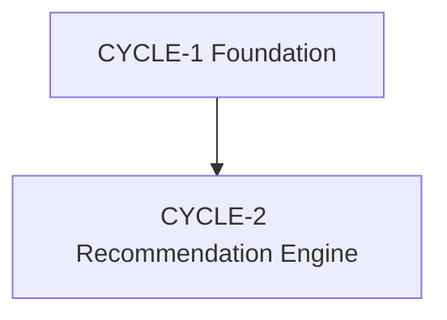

# Build Cycles Overview - What Gift Should I Choose

## Summary

**Total Cycles**: 2
**Cycle Plans**:
- `docs/plans/builds/cycle-1/cycle-plan.md`
- `docs/plans/builds/cycle-2/cycle-plan.md`
**Story Files**: `docs/plans/stories/`

## Cycle Map

| Cycle | BUILDID | Scope Summary | Expected Outcome |
|------|---------|---------------|------------------|
| Cycle 1 | CYCLE-1 | Foundation walking skeleton | Browser page, backend health endpoint, and verified FE/BE connection |
| Cycle 2 | CYCLE-2 | Recommendation engine vertical slice | Exactly three tailored gift suggestions from the completed form flow |

## Dependency Map

- CYCLE-1 has no cycle dependency.
- CYCLE-2 requires the CYCLE-1 walking skeleton and its shared boundaries.
- Within CYCLE-1, Stories 1.1 and 1.2 can begin independently; Story 1.3 requires both.
- Within CYCLE-2, Story 2.1 precedes provider work; Stories 2.2 and 2.3 complete the vertical feature flow sequentially.

## Risk Log

| Risk | Impact | Mitigation |
|------|--------|------------|
| Claude provider output is malformed or unavailable | High | Enforce schema, exact-three result validation, bounded failures, and safe retry UX |
| Provider credentials are misconfigured | High | Server-only environment variables and a pre-demo configuration check |
| MVP scope expands into commerce or accounts | Medium | Keep checkout, authentication, persistence, and analytics explicitly deferred |
| Responsive form/results layout needs iteration | Medium | Validate at mobile, tablet, and desktop breakpoints during Cycle 2 Day 4 |
