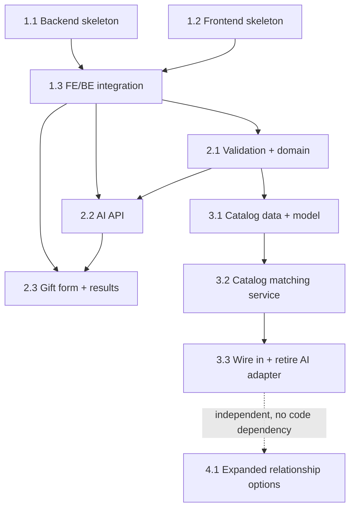

# What Gift Should I Choose - Implementation Plan

**Project**: What Gift Should I Choose | **Version**: 1.1 | **Created**: 2026-09-16
**Author**: ARCHITECT | **Status**: IN PROGRESS

---

## 1. Overview

**Success Criteria**:
- User can enter recipient age, budget, relationship, and interests.
- Application returns exactly three tailored gift suggestions.
- Each recommendation is clearly grounded in the user-supplied inputs.
- The app works as a lightweight MVP with a single user journey and no login requirement.
- The recommendation flow is testable through backend validation and frontend rendering.

**Epic Breakdown**:
- Epic 1: Foundation - establish the walking skeleton across frontend and backend.
- Epic 2: Recommendation engine - implement structured input validation and AI-driven suggestions.
- Epic 3: Curated gift catalog - replace the AI-based recommendation engine with matching against a curated, bundled gift-idea dataset.
- Epic 4: Expanded relationship options - add 6 new relationship values to the dropdown and consolidate the relationship list to a single canonical source.

---

## Dependency Graph

> Story 4.1 is root-independent (`requires: []`) — the dotted edge above only shows that it builds on already-shipped Epic 3 code, not a blocking dependency. A formal `docs/plans/dependency-graph.yml` was not created for this plan update since it adds a single story (the YAML is mandatory only for 2+ new stories in one planning pass).

### Wave Workload Distribution (team_size: 2)

| Wave | Stories | Per Dev | Dev Assignments | Notes |
|------|---------|---------|-----------------|-------|
| 1 | 2 | 1 each | Dev-1: [1.1] / Dev-2: [1.2] | ✅ All devs active |
| 2 | 1 | 1 | Dev-1: [1.3] / Dev-2: — | ⚠️ Serial dependency gate |
| 3 | 1 | 1 | Dev-1: [2.1] / Dev-2: — | ⚠️ Dependency on integration |
| 4 | 2 | 1 each | Dev-1: [2.2] / Dev-2: [2.3] | ✅ All devs active |
| 5 | 1 | 1 | Dev-1: [3.1] / Dev-2: — | ⚠️ Serial dependency gate |
| 6 | 1 | 1 | Dev-1: [3.2] / Dev-2: — | ⚠️ Serial dependency gate |
| 7 | 1 | 1 | Dev-1: [3.3] / Dev-2: — | ⚠️ Serial dependency gate |

---

## EPIC 1: FOUNDATION

**Owner**: DEV | **Goal**: Set up the minimal end-to-end project skeleton and prove the frontend and backend can communicate.

**Prerequisites**: None | **Completion**: Health endpoint works, app shell renders, browser can reach backend.

### Story 1.1: Backend API Skeleton
- Objective: Create the backend foundation with a health endpoint and structured error logging.
- File: `docs/plans/stories/epic-1-story-1.1-backend-api-skeleton.md`

### Story 1.2: Frontend Shell and Form Skeleton
- Objective: Create the Next.js shell and empty form scaffolding for the recommendation flow.
- File: `docs/plans/stories/epic-1-story-1.2-frontend-shell.md`

### Story 1.3: FE/BE Integration and Walking Skeleton
- Objective: Connect the frontend form to the backend health check and verify the app boots end-to-end.
- File: `docs/plans/stories/epic-1-story-1.3-fe-be-integration.md`

---

## EPIC 2: RECOMMENDATION ENGINE

**Owner**: DEV | **Goal**: Implement the actual recommendation flow: validation, AI generation, and user-facing suggestions.

**Prerequisites**: Epic 1 complete | **Completion**: API accepts the request, validates inputs, generates exactly three suggestions, and renders them in the UI.

### Story 2.1: Validation and Recommendation Domain Model
- Objective: Validate age, budget, relationship, and interest inputs and define the recommendation contract.
- File: `docs/plans/stories/epic-2-story-2.1-validation-domain-model.md`

### Story 2.2: AI Recommendation API and Provider Adapter
- Objective: Build the recommendation endpoint and backend adapter for Claude-generated suggestions.
- File: `docs/plans/stories/epic-2-story-2.2-ai-recommendation-api.md`

### Story 2.3: Gift Form and Results Experience
- Objective: Surface the form, handle submissions, and display exactly three recommendation cards.
- File: `docs/plans/stories/epic-2-story-2.3-form-results-experience.md`

---

## EPIC 3: CURATED GIFT CATALOG

**Owner**: DEV | **Goal**: Replace the AI-generated recommendation engine with matching against a curated, bundled gift-idea catalog sourced from a provided spreadsheet.

**Prerequisites**: Epic 2 complete | **Completion**: The API returns exactly three catalog-backed suggestions with no external AI call and no `CLAUDE_API_KEY` dependency.

### Story 3.1: Gift Catalog Data & Domain Model
- Objective: Convert the provided 150-row spreadsheet into a bundled, typed catalog the app can load without any spreadsheet-parsing runtime dependency.
- File: `docs/plans/stories/epic-3-story-3.1-gift-catalog-data-model.md`

### Story 3.2: Catalog Matching Service
- Objective: Implement the age → relationship → interest-score → fallback matching algorithm as a drop-in `RecommendationProvider`.
- File: `docs/plans/stories/epic-3-story-3.2-catalog-matching-service.md`

### Story 3.3: Wire In Catalog Provider & Retire the AI Adapter
- Objective: Swap the API route's default provider to the catalog, delete the Claude adapter, and retire the provider-latency-specific concurrency limiter/timeout while keeping the rate limiter and body-size cap.
- File: `docs/plans/stories/epic-3-story-3.3-wire-catalog-provider.md`

---

## EPIC 4: EXPANDED RELATIONSHIP OPTIONS

**Owner**: DEV | **Goal**: Add 6 new relationship options to the gift form's dropdown and eliminate the hardcoded duplicate relationship list found during the brownfield deep-dive.

**Prerequisites**: None (root-independent; builds on already-shipped Epic 1–3 code) | **Completion**: Dropdown shows 12 relationship options; all 12 validate and match correctly; the original 6 show no regression; no duplicate relationship list remains anywhere in `src/`.

### Story 4.1: Expanded Relationship Options
- Objective: Widen the canonical `RELATIONSHIPS` list to 12 values and fix `GiftForm.tsx` to import it instead of duplicating it.
- File: `docs/plans/stories/epic-4-story-4.1-expanded-relationship-options.md`

---

## Quality Gates

**Per Story**: Follow project patterns, cover edge cases, and keep the app user-safe.
**Per Epic**: Pass the feature test path and verify output is observable and usable.
**Final**: App delivers the core recommendation flow with stable handling for empty and invalid input.

---

## QA Manual Testing Groups

> Epics 1–3 predate this section (added starting with Epic 4); their manual test coverage is documented instead in `docs/testing/test-plan-full.md` and the validation reports under `docs/testing/`.

### Epic 4: Expanded Relationship Options

**Group 1** — Stories: 4.1
Once Story 4.1 is done, QA can test the full relationship-selection flow end-to-end: open the form, confirm the Relationship dropdown shows exactly 12 options in canonical order (the original 6 plus Mortal Enemy, Frenemy, Coworker I Tolerate, Secret Santa Victim, Boss I Need to Impress, Person Whose Name I Forgot), select any new option alongside a valid age/budget/interests, submit, and confirm exactly 3 recommendation cards render — no different from submitting with an original relationship value. Also verify no regression on the original 6 values, and that submitting an unsupported relationship string directly against the API returns a 400 listing all 12 valid values. No catalog content changes to verify — the same 150 gift entries back every relationship value.
