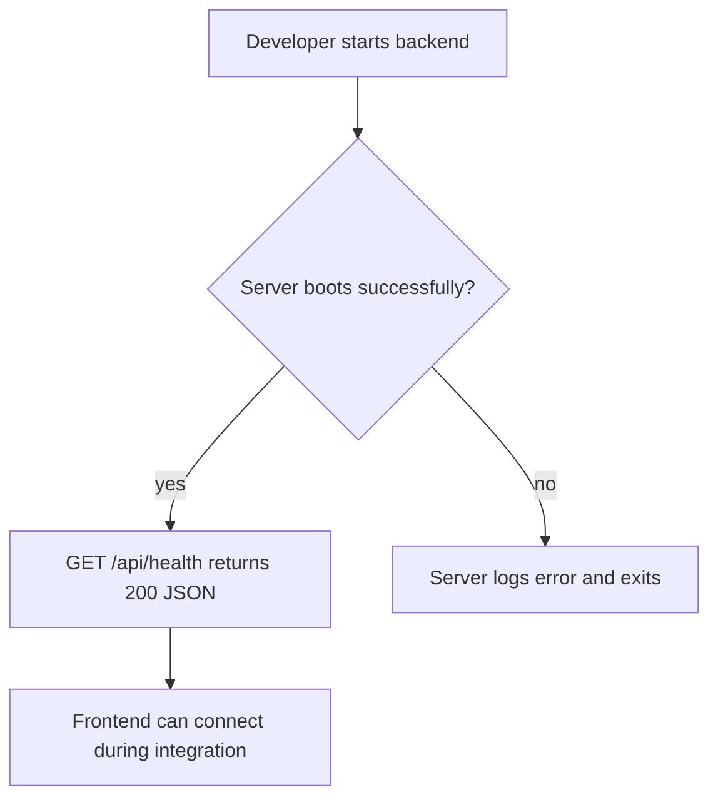

### Story 1.1: Backend API Skeleton

**BUILDID**: CYCLE-1 | **Epic**: 1 - FOUNDATION | **ID**: 1.1 | **Date**: 2026-09-16 | **Jira**: LOCAL | **GitHub**: LOCAL | **AzureDevOps**: LOCAL
**Wave**: 1
**Requires**: []
**Enables**: [1.3, 2.1, 2.2]
**Files Touched**:
  - src/app/api/health/route.ts
  - src/lib/logger.ts
  - src/lib/errors.ts
**Roles Ref**: docs/requirements.md#roles--permissions-matrix — personas this story differentiates: single-actor — no role variation
**QA Candidate**: No — pure infra/seed/config; nothing user-observable beyond a backend health endpoint.

#### 👤 User Reference

**Description**:
This story creates the backend foundation for the gift recommendation app and exposes a health check endpoint that confirms the service is running. It does not yet generate recommendations; instead, it gives the project a working API base and a predictable error/observability pattern for the rest of the implementation.

**Acceptance Criteria**:
- The backend starts successfully in the local development environment.
- A health endpoint responds with a successful status and a simple JSON payload.
- Structured logging and error helpers are available for later stories.
- The response contract is stable enough for the frontend to trust the backend during the walking skeleton.

**User Journey**:
- **Entry**: a developer opens the app in local mode and confirms the service is available.
- **Load**: the backend boots with the route mounted and logs startup metadata.
- **Render**: the health endpoint returns a simple status body rather than an empty response.
- **Interact**: the frontend can call the endpoint during integration and inspect a valid machine-readable response.
- **Empty/error**: if the service fails to boot, the server surfaces a clear error and logs the failure rather than silently failing.
- **Responsive**: the route remains lightweight and does not require extra dependencies or authentication.



#### 🤖 AI Agent Reference

**Must Read**:
- `docs/requirements.md` - project scope and single-actor user flow
- `docs/architecture/design/00-system-architecture-greenfield.md` - backend and API responsibilities
- `docs/architecture/design/01-patterns-and-standards-greenfield.md` - logging and error-handling conventions

**Description**:
Create a minimal backend server using the project stack and establish a health route required for the walking skeleton. This includes a typed error abstraction and a structured logger, both of which will be reused by later validation and AI provider stories. The story is intentionally narrow: it makes the backend runnable without yet adding core business logic.

**Acceptance Criteria**:
- `GET /api/health` returns a `200` JSON success response such as `{ status: "ok" }`.
- The server exposes an app-level error boundary and does not swallow exceptions.
- Request metadata is logged in a structured format.
- All root-level backend infrastructure sits in the service layer rather than the UI.

**RBAC Enforcement**:
No role-differentiated access — single actor.

**System responses + error cases**:

| Trigger | Response | Side-effect |
|---------|----------|-------------|
| Backend startup | Server boots successfully | logger emits startup metadata |
| GET /api/health | `200` + JSON `{ status: "ok" }` | no write to persistent storage |
| Internal route exception | `500` error with safe message | error logged with context |
| Missing route | `404` default | no mutation |

**Prerequisites**: None.

**Context**: `docs/requirements.md`, `docs/architecture/design/00-system-architecture-greenfield.md`, `docs/architecture/design/01-patterns-and-standards-greenfield.md`

**Patterns**: Layered monolith + structured logging - See `docs/architecture/design/01-patterns-and-standards-greenfield.md`

**Steps**:
1. Initialize the backend project structure and install required dependencies for the local service.
   ```ts
   export async function GET() {
     return Response.json({ status: 'ok' });
   }
   ```
2. Add a health route and confirm it responds with the expected JSON payload.
3. Add a structured logger and typed error helper to standardize later service failures.
4. Verify the route works with a local dev run and logs startup details.

**Tests**:
```ts
describe('GET /api/health', () => {
  it('returns a 200 success payload', async () => {
    const response = await GET();
    expect(response.status).toBe(200);
  });
});
```

Manual: Start the backend locally and hit the health route in a browser or curl.

**Quality**: ESLint 0 errors, tests pass, no console errors.

**OUT**: ❌ Not implementing recommendation logic yet.

**Evidence**: Backend response payload and local startup logs.
