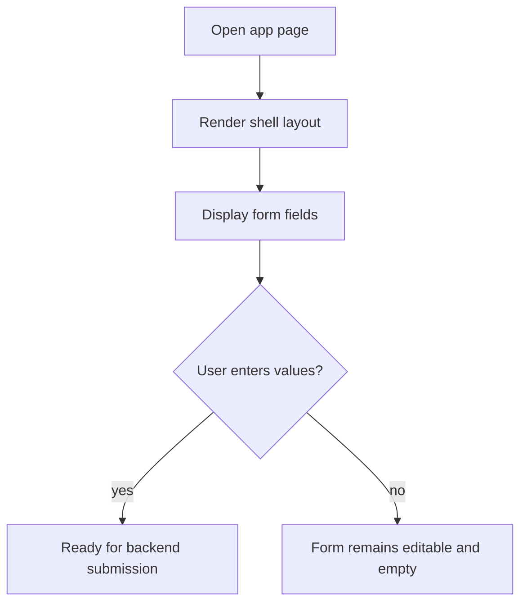

### Story 1.2: Frontend Shell and Form Skeleton

**BUILDID**: CYCLE-1 | **Epic**: 1 - FOUNDATION | **ID**: 1.2 | **Date**: 2026-09-16 | **Jira**: LOCAL | **GitHub**: LOCAL | **AzureDevOps**: LOCAL
**Wave**: 1
**Requires**: []
**Enables**: [1.3, 2.3]
**Files Touched**:
  - src/app/page.tsx
  - src/components/forms/GiftForm.tsx
  - src/components/shared/Button.tsx
  - src/components/shared/Input.tsx
**Roles Ref**: docs/requirements.md#roles--permissions-matrix — personas this story differentiates: single-actor — no role variation
**QA Candidate**: No — foundation UI shell only; behavior remains intentionally minimal until backend integration.

#### 👤 User Reference

**Description**:
This story creates the frontend shell for the app and sets up the basic gift form fields the user will eventually fill out. The page layout is intentionally simple and does not yet generate recommendations; it just provides the form structure and consistent primitive components that later stories will wire to the real recommendation flow.

**Acceptance Criteria**:
- A browser page renders a basic gift recommendation form.
- The form includes fields for age, budget, relationship, and interests.
- Shared primitives exist for inputs and buttons to be reused across the app.
- The app shell is ready for the backend integration story.

**User Journey**:
- **Entry**: the user opens the web app and sees the gifting form.
- **Load**: the page renders a clean single-page shell with the fields visible.
- **Render**: form controls appear in a predictable, responsive layout.
- **Interact**: the user can type into the fields and trigger an action when the recommendation logic becomes available.
- **Empty/error**: fields show a placeholder and remain usable while no recommendation data is yet loaded.
- **Responsive**: layout adapts as the app grows while staying simple for an MVP.



#### 🤖 AI Agent Reference

**Must Read**:
- `docs/requirements.md` - required form inputs and scope
- `docs/architecture/design/00-system-architecture-greenfield.md` - frontend responsibilities
- `docs/architecture/design/01-patterns-and-standards-greenfield.md` - shared primitive guidance

**Description**:
Create the Next.js page shell and the reusable UI primitives for the application form. This is a scaffold-only story focused on a clean structure, typed inputs, and later integration points. The UI must not yet contain complex recommendation logic or hard-coded AI output.

**Acceptance Criteria**:
- `src/app/page.tsx` renders the main user entry experience.
- The form contains required fields for age, budget, relationship, and interests.
- Shared primitives are created under `src/components/shared` and are reused across the app.
- The frontend is configured for the later API integration story without assuming any business logic is complete.

**RBAC Enforcement**:
No role-differentiated access — single actor.

**System responses + error cases**:

| Trigger | Response | Side-effect |
|---------|----------|-------------|
| Page load | App shell renders | no API calls yet |
| Form field change | Controlled input state updates | local UI state only |
| Submission before backend ready | No data submission yet | form remains idle |
| Empty form | placeholder/empty state visible | no error thrown |

**Prerequisites**: None.

**Context**: `docs/requirements.md`, `docs/architecture/design/00-system-architecture-greenfield.md`, `docs/architecture/design/01-patterns-and-standards-greenfield.md`

**Patterns**: UI primitive catalogue + single-page MVP - See `docs/architecture/design/01-patterns-and-standards-greenfield.md`

**Steps**:
1. Set up the home page and main layout with aligned spacing and basic styling.
2. Create a form component that includes age, budget, relationship, and interests inputs.
3. Create shared primitive components for buttons and inputs.
4. Confirm the form is represented as a controlled, testable structure.

**Tests**:
```ts
describe('GiftForm', () => {
  it('renders the required fields', () => {
    render(<GiftForm />);
    expect(screen.getByLabelText(/age/i)).toBeInTheDocument();
  });
});
```

Manual: Load the page locally and inspect the form fields and layout.

**Quality**: ESLint 0 errors, component tests pass, no console errors.

**OUT**: ❌ Not implementing recommendation generation yet.

**Evidence**: Screen render and form field presence.
