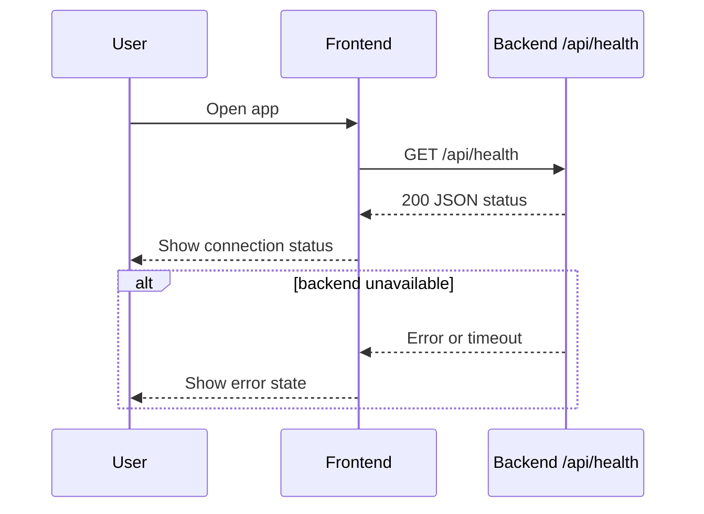

### Story 1.3: FE/BE Integration and Walking Skeleton

**BUILDID**: CYCLE-1 | **Epic**: 1 - FOUNDATION | **ID**: 1.3 | **Date**: 2026-09-16 | **Jira**: LOCAL | **GitHub**: LOCAL | **AzureDevOps**: LOCAL
**Wave**: 2
**Requires**: [1.1, 1.2]
**Enables**: [2.1, 2.2, 2.3]
**Files Touched**:
  - src/app/page.tsx
  - src/app/api/health/route.ts
  - src/lib/logger.ts
**Roles Ref**: docs/requirements.md#roles--permissions-matrix — personas this story differentiates: single-actor — no role variation
**QA Candidate**: Yes — **Observable:** a user can see the app connect to the backend health endpoint. **Mechanism:** a FE fetch hits GET /api/health and the page reflects the result. **Authz & preconditions:** single-user app, no RBAC. **Edge/idempotency:** failed health checks show an error state instead of crashing. **Regression:** ensures the foundation remains connected for later recommendation work.

#### 👤 User Reference

**Description**:
This story stitches the frontend and backend together for the first time. The app loads the homepage, calls the backend health endpoint, and shows a connection status so the team can confirm the walking skeleton is fully wired before the recommendation logic goes live.

**Acceptance Criteria**:
- The page loads and calls the backend health route.
- The user sees a clear success or failure state for the backend connection.
- A failed call does not crash the page or block the app unnecessarily.
- The app is now ready for the recommendation implementation stories to build on top of it.

**User Journey**:
- **Entry**: the user loads the homepage in a browser.
- **Load**: the page initiates a lightweight backend connectivity check.
- **Render**: the health status appears as either connected or unavailable.
- **Interact**: the user can continue to the form once the app is verified as reachable.
- **Empty/error**: if the backend is offline, the page clearly states the service is unavailable without leaving the user in a blank state.
- **Responsive**: page remains stable across the simple health validation path.



#### 🤖 AI Agent Reference

**Must Read**:
- `docs/requirements.md` - product scope and single-user flow
- `docs/architecture/design/00-system-architecture-greenfield.md` - request/response boundary and component responsibilities
- `docs/architecture/design/01-patterns-and-standards-greenfield.md` - error handling and logging conventions

**Description**:
Connect the frontend page to the health endpoint built in the previous story and display the result in a user-visible status. This is the minimum functional wiring required to prove the app is ready for the actual recommendation feature work.

**Acceptance Criteria**:
- The homepage makes a network request to the backend health route on load.
- A success response shows a valid connected state.
- A failure response displays an inline error message and prevents the app from entering a blank state.
- The connection logic is isolated and easy to replace when the recommendation API is added.

**RBAC Enforcement**:
No role-differentiated access — single actor.

**System responses + error cases**:

| Trigger | Response | Side-effect |
|---------|----------|-------------|
| Health check success | `200` + `{ status: "ok" }` | UI shows connected state |
| Health check failure | `500` or timeout | UI shows error state, no crash |
| Repeat page load | same status is re-fetched | no persisted state created |
| Empty or malformed response | fallback error UI | no exception crash |

**QA-observable behaviour**:
- On a healthy backend, the page shows a connected status for the app.
- On a failing backend, the page surfaces a clear error and does not crash.
- The health status is observable to the user from the homepage without requiring hidden developer tools.
- **What does NOT change**: no recommendation data is generated or persisted yet.

**Prerequisites**: Story 1.1 and 1.2 complete.

**Context**: `src/app/page.tsx`, `src/app/api/health/route.ts`, `docs/architecture/design/00-system-architecture-greenfield.md`

**Patterns**: Layered monolith + frontend/back-end boundary - See `docs/architecture/design/01-patterns-and-standards-greenfield.md`

**Steps**:
1. Make the home page call the backend health endpoint with the standard client-side fetch pattern.
2. Map the response to visible UI state: connected vs unavailable.
3. Handle timeout, network, and unexpected server failures with a clear error message.
4. Confirm the feature works in the local browser without crashing.

**Tests**:
```ts
describe('homepage health connection', () => {
  it('shows connected state when the backend responds', async () => {
    render(<HomePage />);
    expect(await screen.findByText(/connected/i)).toBeInTheDocument();
  });
});
```

Manual: Start both the frontend and backend, open the page, and confirm the status reads correctly.

**Quality**: ESLint 0 errors, tests pass, no console errors.

**OUT**: ❌ Not implementing the recommendation engine yet.

**Evidence**: Working frontend-backend connectivity check and local browser rendering.
