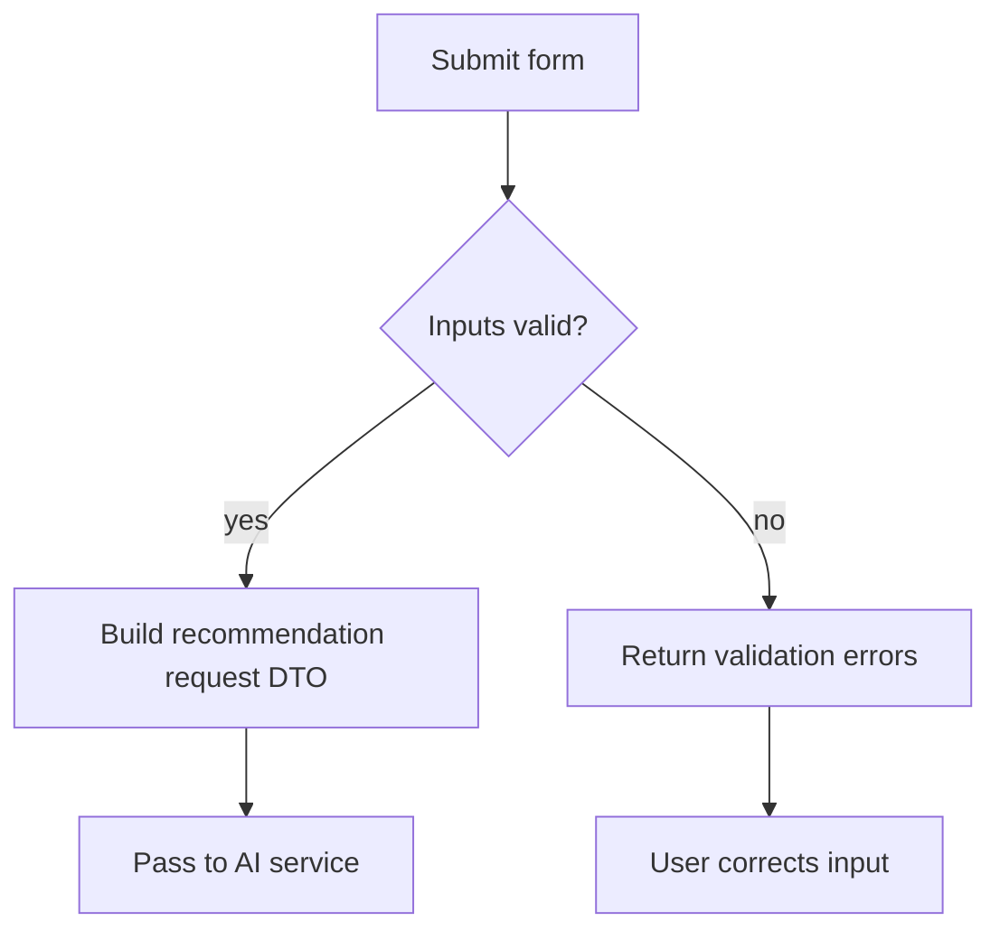

### Story 2.1: Validation and Recommendation Domain Model

**BUILDID**: CYCLE-2 | **Epic**: 2 - RECOMMENDATION ENGINE | **ID**: 2.1 | **Date**: 2026-09-16 | **Jira**: LOCAL | **GitHub**: LOCAL | **AzureDevOps**: LOCAL
**Wave**: 3
**Requires**: [1.3]
**Enables**: [2.2, 2.3]
**Files Touched**:
  - src/domain/entities/GiftRecommendation.ts
  - src/application/validation/validateGiftInput.ts
  - src/application/dto/GiftSuggestionRequest.ts
**Roles Ref**: docs/requirements.md#roles--permissions-matrix — personas this story differentiates: single-actor — no role variation
**QA Candidate**: Yes — **Observable:** the app rejects invalid input and accepts valid recommendation requests. **Mechanism:** backend validation resolves the request DTO and returns 400/422 errors on bad input. **Authz & preconditions:** single-user app, no RBAC. **Edge/idempotency:** empty strings and invalid relationship values fail safely without creating records. **Regression:** validation ensures the recommendation engine is only called with safe values.

#### 👤 User Reference

**Description**:
This story defines the rules for the recommendation request and validates that the user supplied all required inputs before any AI call is made. It ensures the app only accepts a valid recipient age, budget, relationship, and interests, and it prepares the data contract the AI adapter will use to generate exactly three suggestions.

**Acceptance Criteria**:
- The app accepts a request only when age, budget, relationship, and interests are present and valid.
- Relationship values are restricted to the required list: Friend, Partner, Parent, Child, Sibling, Colleague.
- Budget and age values are validated to avoid impossible or nonsensical inputs.
- Invalid input produces a clear user-readable error and never reaches the AI provider.
- The recommendation response contract is defined consistently for the downstream API and UI.

**User Journey**:
- **Entry**: the user fills out the form with a possible gift request.
- **Load**: the app prepares the request DTO from the form state.
- **Render**: the page displays validation feedback when values are missing or invalid.
- **Interact**: the user submits only valid data or corrects invalid values.
- **Empty/error**: missing age, zero budget, or unsupported relationship results in an inline validation message instead of a backend crash.
- **Responsive**: validation is quick and consistent without slowing the user.



#### 🤖 AI Agent Reference

**Must Read**:
- `docs/requirements.md` - required input fields and relationship list
- `docs/architecture/design/00-system-architecture-greenfield.md` - API contract and validation boundaries
- `docs/architecture/design/01-patterns-and-standards-greenfield.md` - validation and error handling approach

**Description**:
Implement the domain-level validation and DTO layer that prepares the recommendation request. This story is responsible for preserving clean input boundaries before the AI provider receives any data and for ensuring the downstream recommendation model is consistent across the service and frontend.

**Acceptance Criteria**:
- Valid requests produce a normalized recommendation request object.
- Invalid requests return a `400` validation error with a clear, user-safe message.
- Unsupported relationship values are rejected before any provider call is made.
- The domain model includes a representation for a recommendation item and all required metadata.

**RBAC Enforcement**:
No role-differentiated access — single actor.

**System responses + error cases**:

| Trigger | Response | Side-effect |
|---------|----------|-------------|
| Valid request | `200`/accepted downstream DTO created | no persistence change |
| Missing age | `400 { detail: 'Age is required' }` | no AI call |
| Invalid relationship | `422` or `400` | no provider call |
| Zero or negative budget | `400` validation error | no provider call |
| Empty interests | `400` if required; otherwise use safe defaults | no recommendation generated |

**QA-observable behaviour**:
- A valid request reaches the AI service with all required fields populated.
- Invalid values are blocked at the API boundary before the provider call.
- The user sees a clear error message rather than an unhandled exception.
- **What does NOT change**: no recommendation output is returned until validation passes.

**Prerequisites**: Story 1.3 complete.

**Context**: `docs/requirements.md`, `docs/architecture/design/00-system-architecture-greenfield.md`, `src/application/validation/validateGiftInput.ts`

**Patterns**: Validation boundary + typed DTOs - See `docs/architecture/design/01-patterns-and-standards-greenfield.md`

**Steps**:
1. Define the recommendation request shape and entity contract in typed TypeScript models.
   ```ts
   export type Relationship = 'Friend' | 'Partner' | 'Parent' | 'Child' | 'Sibling' | 'Colleague';
   ```
2. Implement server-side validation for age, budget, relationship, and interests.
3. Reject bad values before passing request data to provider code.
4. Ensure the validation layer returns explicit error messages and keeps the provider call isolated.

**Tests**:
```ts
describe('validateGiftInput', () => {
  it('rejects unsupported relationship values', () => {
    expect(() => validateGiftInput({
      recipientAge: 25,
      budget: 50,
      relationship: 'Coworker',
      interests: 'music',
    })).toThrow();
  });
});
```

Manual: Send invalid API payloads using curl or a browser-based dev tool and confirm they are rejected cleanly.

**Quality**: ESLint 0 errors, tests pass, coverage ≥85% for validation paths.

**OUT**: ❌ Not implementing a live AI provider call yet.

**Evidence**: Validation errors and successful DTO creation in unit tests.
