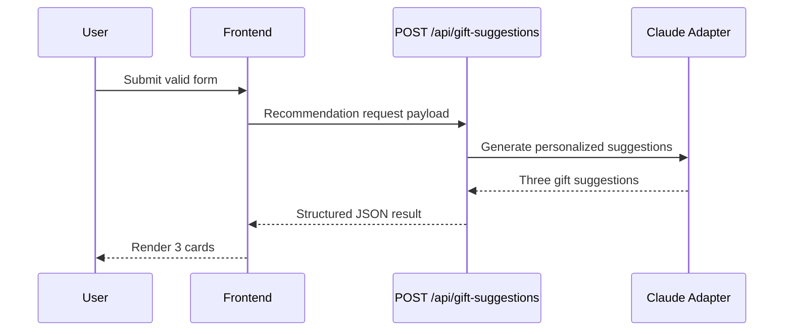

### Story 2.2: AI Recommendation API and Provider Adapter

**BUILDID**: CYCLE-2 | **Epic**: 2 - RECOMMENDATION ENGINE | **ID**: 2.2 | **Date**: 2026-09-16 | **Jira**: LOCAL | **GitHub**: LOCAL | **AzureDevOps**: LOCAL
**Wave**: 4
**Requires**: [1.3, 2.1]
**Enables**: [2.3]
**Files Touched**:
  - src/app/api/gift-suggestions/route.ts
  - src/app/api/gift-suggestions/schema.ts
  - src/infrastructure/ai/ClaudeRecommendationClient.ts
  - src/domain/services/RecommendationService.ts
**Roles Ref**: docs/requirements.md#roles--permissions-matrix — personas this story differentiates: single-actor — no role variation
**QA Candidate**: Yes — **Observable:** the API returns three suggestions based on a supported request. **Mechanism:** POST /api/gift-suggestions validates input and calls the Claude adapter to build a recommendation payload. **Authz & preconditions:** single-user app, no RBAC; provider key stays server-side. **Edge/idempotency:** provider failures produce safe fallback errors and never leak raw provider details. **Regression:** recommendation generation and provider boundaries remain stable.

#### 👤 User Reference

**Description**:
This story implements the actual recommendation generation endpoint. It takes the user’s structured inputs, validates them against the domain rules, calls the AI provider behind the application layer, and returns exactly three tailored gift suggestions. The app keeps the AI integration server-side so secrets and prompt concerns stay out of the browser.

**Acceptance Criteria**:
- A valid request returns exactly three recommendation objects.
- Each recommendation includes a title, description, rationale, expected price range, and purchase link where available.
- The providers are isolated behind a single adapter and not exposed to the UI.
- Provider downtime or invalid responses produce a safe error message rather than a broken app.

**User Journey**:
- **Entry**: the user completes the form and submits it.
- **Load**: the browser sends a request to the gift recommendations endpoint.
- **Render**: the server validates the payload and calls the recommendation provider.
- **Interact**: three suggestions render on the page, each tied to the user’s inputs.
- **Empty/error**: if the provider fails or the payload is malformed, the UI shows an error message and no broken results.
- **Responsive**: the request remains fast, simple, and contained to the MVP use case.



#### 🤖 AI Agent Reference

**Must Read**:
- `docs/requirements.md` - success criteria and scope
- `docs/architecture/design/00-system-architecture-greenfield.md` - API and AI integration design
- `docs/architecture/design/01-patterns-and-standards-greenfield.md` - logging and error handling conventions

**Description**:
Create the backend route that receives the recommendation input, runs validation, and invokes the AI adapter. The route and service must return a structured, predictable recommendation payload with the exact result count required for the MVP while isolating external provider logic.

**Acceptance Criteria**:
- `POST /api/gift-suggestions` accepts a valid structured payload and returns a JSON array of 3 recommendations.
- The AI integration is contained inside `src/infrastructure/ai/ClaudeRecommendationClient.ts` and consumed through the recommendation service.
- Errors from the provider are mapped to a user-safe JSON error.
- The route does not expose secrets or prompt internals to the browser.

**RBAC Enforcement**:
No role-differentiated access — single actor.

**System responses + error cases**:

| Trigger | Response | Side-effect |
|---------|----------|-------------|
| Valid submission | `200` + three recommendations | UI receives structured result |
| Invalid request | `400` validation error | no provider call |
| Provider rate limit | `429` or `503` user-safe error | logs error + no partial data |
| Malformed provider data | `500` safe error | logger records provider failure |
| Repeat same submission | idempotent if request repeated; no duplicate writes | no persistent side effect |

**QA-observable behaviour**:
- The API returns exactly three entries for valid requests.
- The result payload contains the expected recommendation metadata fields.
- Invalid or rate-limited requests fail safely and do not expose raw provider details.
- **What does NOT change**: the app still has no user account or multi-user auth model.

**Prerequisites**: Story 2.1 complete.

**Context**: `src/app/api/gift-suggestions/route.ts`, `src/infrastructure/ai/ClaudeRecommendationClient.ts`, `docs/architecture/design/00-system-architecture-greenfield.md`

**Patterns**: AI adapter + service boundary - See `docs/architecture/design/01-patterns-and-standards-greenfield.md`

**Steps**:
1. Build the POST route using the validated input contract.
2. Call the recommendation service that abstracts AI provider execution.
3. Map provider output into the recommendation domain model and enforce exactly three results.
4. Return a structured JSON response and handle provider errors with safe user messaging.

**Tests**:
```ts
describe('POST /api/gift-suggestions', () => {
  it('returns 3 recommendations for a valid request', async () => {
    const response = await requestRecommendation(validInput);
    expect(response.recommendations).toHaveLength(3);
  });
});
```

Manual: Submit valid values through the form and verify the API response contains exactly three items.

**Quality**: ESLint 0 errors, tests pass, provider call path validated, no console errors.

**OUT**: ❌ Not implementing a full marketplace backend or auth system.

**Evidence**: API response payload and unit/integration test output.
