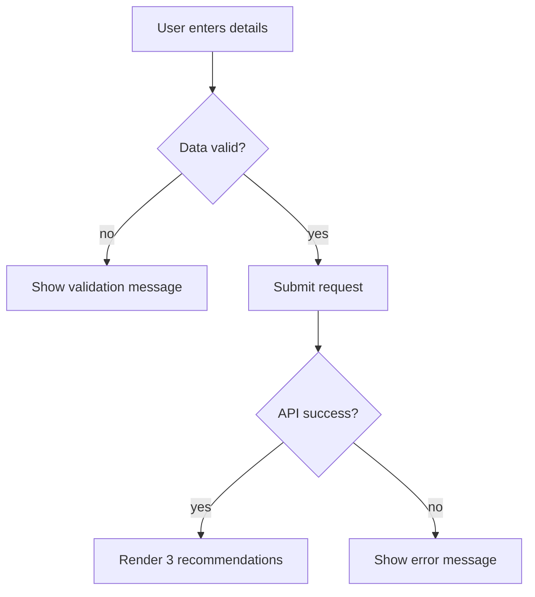

### Story 2.3: Gift Form and Results Experience

**BUILDID**: CYCLE-2 | **Epic**: 2 - RECOMMENDATION ENGINE | **ID**: 2.3 | **Date**: 2026-09-16 | **Jira**: LOCAL | **GitHub**: LOCAL | **AzureDevOps**: LOCAL
**Wave**: 4
**Requires**: [1.3, 2.1, 2.2]
**Enables**: []
**Files Touched**:
  - src/components/results/GiftResults.tsx
  - src/components/forms/GiftForm.tsx
  - src/app/page.tsx
  - src/components/shared/Card.tsx
**Roles Ref**: docs/requirements.md#roles--permissions-matrix — personas this story differentiates: single-actor — no role variation
**QA Candidate**: Yes — **Observable:** the user submits a valid request and sees exactly three relevant suggestions. **Mechanism:** the form posts to the recommendation API, and the result panel renders the response. **Authz & preconditions:** single-user app, no RBAC. **Edge/idempotency:** form validation and empty results display safe states. **Regression:** verifies the entire end-to-end buy-gift journey works and the app does not produce more or fewer than three items.

#### 👤 User Reference

**Description**:
This story brings the gift recommendation flow to life in the browser. It wires the form to the backend API, shows a clean loading state while suggestions are generated, and renders the exact three recommendations in a results panel. This is the visible MVP feature end to end.

**Acceptance Criteria**:
- The user can fill in age, budget, relationship, and interests and submit the form.
- The app sends the request to the backend recommendation API.
- The page shows exactly three suggestions after success.
- Invalid or failed requests show a user-friendly error message rather than a broken UI.
- The final screen is clean, readable, and suitable for a lightweight MVP.

**User Journey**:
- **Entry**: the user enters the recipient details.
- **Load**: the form is ready and the page is interactive.
- **Render**: loading state appears while the recommendation request is sent.
- **Interact**: the user submits, waits for the recommendation response, and reads the cards.
- **Empty/error**: if validation fails or the provider is unavailable, the UI reveals a friendly error message without losing layout integrity.
- **Responsive**: the page remains readable and usable on a normal desktop viewport.



#### 🤖 AI Agent Reference

**Must Read**:
- `docs/requirements.md` - user flow and output constraints
- `docs/architecture/design/00-system-architecture-greenfield.md` - UI and API integration contract
- `docs/architecture/design/01-patterns-and-standards-greenfield.md` - reusable UI primitives and error-state conventions

**Description**:
Connect the form and result panel to the recommendation API and ensure the interaction model matches the product requirements. This is the feature-completion story in which the user sees the final recommendation experience from input to result rendering.

**Acceptance Criteria**:
- The form submits valid data to the recommendation endpoint without direct provider access.
- The UI renders exactly three recommendation cards.
- Loading and empty states are clear and non-blocking.
- Error states map cleanly to user-safe messages.

**RBAC Enforcement**:
No role-differentiated access — single actor.

**System responses + error cases**:

| Trigger | Response | Side-effect |
|---------|----------|-------------|
| Valid submission | `200` + 3 results | renders cards |
| Loading request | pending state | disables repeated submits |
| Validation failure | inline error state | no API call |
| Provider failure | safe error message | no broken result card array |
| Empty results | empty-state UI | no crash |

**QA-observable behaviour**:
- For a valid request, the page shows exactly three recommendation cards.
- For an invalid request, the UI shows validation feedback instead of submitting.
- For provider failure, the user sees a friendly error state and no malformed result output.
- **What does NOT change**: there is still no multi-user or admin concept.

**Prerequisites**: Story 2.2 complete.

**Context**: `src/app/page.tsx`, `src/components/forms/GiftForm.tsx`, `src/components/results/GiftResults.tsx`, `docs/architecture/design/00-system-architecture-greenfield.md`

**Patterns**: Shared UI primitives + API consumer pattern - See `docs/architecture/design/01-patterns-and-standards-greenfield.md`

**Steps**:
1. Connect the form to the backend recommendation route and maintain input state.
2. Show a loading state while the request is in flight.
3. Render recommendation cards for the response payload with consistent styling.
4. Add the error and empty-state contract to avoid UI breakage when things fail.

**Tests**:
```ts
describe('Gift recommendation flow', () => {
  it('renders exactly three suggestions for a valid submission', async () => {
    render(<HomePage />);
    // user fills out form and submits
    expect(screen.getAllByTestId('gift-card')).toHaveLength(3);
  });
});
```

Manual: Submit a valid prompt through the app and verify the UI shows the three cards and no more.

**Quality**: ESLint 0 errors, tests pass, UI flow validated, no console errors.

**OUT**: ❌ Not implementing marketplace checkout or account features.

**Evidence**: Successful end-to-end recommendation flow in browser and test output.
