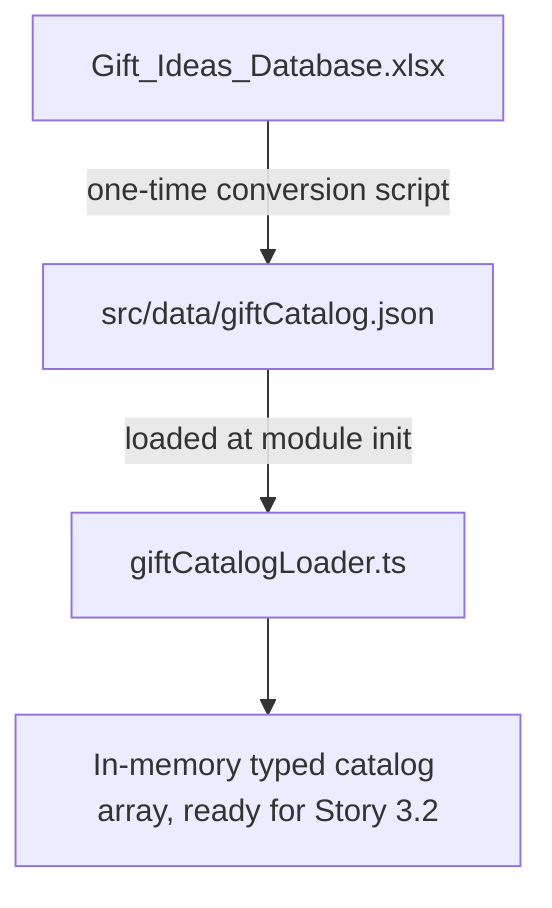

### Story 3.1: Gift Catalog Data & Domain Model

**BUILDID**: NO-CYCLE | **Epic**: 3 - CURATED GIFT CATALOG | **ID**: 3.1 | **Date**: 2026-09-18 | **Jira**: LOCAL | **GitHub**: LOCAL | **AzureDevOps**: LOCAL
**Wave**: 5
**Requires**: [2.1]
**Enables**: [3.2]
**Files Touched**:
  - src/data/giftCatalog.json
  - src/infrastructure/catalog/giftCatalogLoader.ts
  - scripts/convert-gift-catalog.py
**Roles Ref**: docs/requirements.md#roles--permissions-matrix — personas this story differentiates: single-actor — no role variation
**QA Candidate**: No — pure data/loader groundwork; nothing user-observable until Story 3.2 wires matching on top of it.

#### 👤 User Reference

**Description**:
This story replaces the external AI-generated gift ideas with a curated, reviewable catalog of 150 real gift ideas supplied by the product owner as a spreadsheet. Instead of asking an AI model to invent suggestions on every request, the app now draws from a fixed, known-good list — so every recommendation the user ever sees is one a human actually picked and can trace back to. This story only prepares that catalog for the app to use; the matching logic that picks 3 relevant ones comes next.

**Acceptance Criteria**:
- The 150 gift ideas from the provided spreadsheet are available to the app in a format it can read without needing the original spreadsheet at runtime.
- Every catalog entry carries the same information the app already shows on a recommendation card: a name, a description, and a price range.
- No spreadsheet-parsing library or the spreadsheet file itself ships as part of the running app — only the converted data.

**User Journey**:
- **Entry**: N/A — this is a backend data-preparation step with no direct UI surface of its own.
- **Load**: on server start, the catalog data loads once into memory.
- **Render**: nothing renders yet; the catalog is inert until Story 3.2 queries it.
- **Interact**: N/A.
- **Empty/error**: if the catalog file is missing or malformed, the app fails loudly at startup/build time rather than silently serving zero gift ideas later.
- **Responsive**: N/A.



#### 🤖 AI Agent Reference

**Must Read**:
- `docs/requirements.md` - updated Technical Constraints (catalog-based matching, no external AI call)
- `docs/architecture/design/01-patterns-and-standards-greenfield.md` - project structure and configuration pattern (no hardcoded external file paths; layered architecture)
- `src/domain/entities/GiftRecommendation.ts` - existing recommendation shape this catalog must map into
- The source spreadsheet's own `README` sheet (embedded documentation of columns and suggested matching logic) — already reviewed; column layout and semantics below are transcribed from it, not guessed

**Description**:
Convert the 150-row `Gifts` sheet from the provided `Gift_Ideas_Database.xlsx` into a bundled, version-controlled `src/data/giftCatalog.json`, and add a small typed loader that reads it once into memory. The spreadsheet's `Gifts` sheet columns are: `GiftID`, `GiftName`, `Description`, `InterestCategory`, `Keywords` (comma-separated), `MinRecipientAge`, `MaxRecipientAge`, `RelationshipTags` (comma-separated subset of Friend/Partner/Parent/Child/Sibling/Colleague, or the literal `All`), `PriceRangeUSD`. There is no product-link column and no explicit rationale/relationship-fit sentence — those are synthesized in Story 3.2 at match time, not stored statically, so the catalog stays a thin data source rather than duplicating derived text.

**Acceptance Criteria**:
- A one-time conversion step (a small script, not a runtime dependency) reads the spreadsheet and writes `src/data/giftCatalog.json` as an array of 150 objects, one per row, using the field names below.
- Each JSON entry has: `giftId` (string, e.g. `G001`), `name` (string), `description` (string), `interestCategory` (string), `keywords` (string array, split/trimmed from the comma-separated cell), `minRecipientAge` (integer), `maxRecipientAge` (integer), `relationshipTags` (string array; the literal `["All"]` when the cell is `All`), `priceRangeUsd` (string, e.g. `$40-$80`).
- `giftCatalogLoader.ts` exports a typed `GiftCatalogEntry` interface matching the JSON shape and a `loadGiftCatalog(): GiftCatalogEntry[]` function that reads the bundled JSON (via a static `import`, so it is type-checked and bundled at build time, not read from disk at request time).
- No `xlsx`/spreadsheet-parsing package is added to `package.json` dependencies — the conversion script is a one-time, standalone utility (Python's standard library `zipfile`/`xml.etree`, matching how this conversion was actually done) kept under `scripts/`, not part of the Next.js app's runtime bundle.
- `giftId` values are unique across all 150 entries (verified by a test, not just assumed from the source data).

**RBAC Enforcement**:
No role-differentiated access — single actor.

**System responses + error cases**:

| Trigger | Response | Side-effect |
|---------|----------|-------------|
| Module import at server start | `loadGiftCatalog()` returns 150 typed entries | none — pure in-memory read |
| Catalog JSON fails to parse / is malformed | Module-load-time exception (fails the build/start, not a silent empty catalog) | no server starts with a broken catalog |
| Repeat calls to `loadGiftCatalog()` | Same 150 entries returned each time | no mutation, no persistent state |

**Prerequisites**: Story 2.1 complete (defines the `GiftRecommendation` shape this catalog will eventually be mapped into by Story 3.2).

**Context**: `src/domain/entities/GiftRecommendation.ts`, `docs/architecture/design/01-patterns-and-standards-greenfield.md`

**Patterns**: Infrastructure adapter isolation (catalog access lives under `src/infrastructure/catalog/`, mirroring the existing `src/infrastructure/ai/` boundary) - See `docs/architecture/design/01-patterns-and-standards-greenfield.md`

**Steps**:
1. Write `scripts/convert-gift-catalog.py` (standard library only) that opens the `.xlsx` as a zip, parses `xl/worksheets/sheet2.xml` (the `Gifts` sheet), and writes `src/data/giftCatalog.json` with the field mapping above.
   ```python
   entry = {
       "giftId": row[0],
       "name": row[1],
       "description": row[2],
       "interestCategory": row[3],
       "keywords": [k.strip() for k in row[4].split(",") if k.strip()],
       "minRecipientAge": int(row[5]),
       "maxRecipientAge": int(row[6]),
       "relationshipTags": [t.strip() for t in row[7].split(",") if t.strip()],
       "priceRangeUsd": row[8],
   }
   ```
2. Run the script once against the provided spreadsheet and commit the resulting `src/data/giftCatalog.json`.
3. Add `src/infrastructure/catalog/giftCatalogLoader.ts`:
   ```ts
   import catalogData from '@/data/giftCatalog.json';

   export interface GiftCatalogEntry {
     giftId: string;
     name: string;
     description: string;
     interestCategory: string;
     keywords: string[];
     minRecipientAge: number;
     maxRecipientAge: number;
     relationshipTags: string[];
     priceRangeUsd: string;
   }

   export function loadGiftCatalog(): GiftCatalogEntry[] {
     return catalogData as GiftCatalogEntry[];
   }
   ```
4. Confirm the JSON import resolves under the project's existing `tsconfig.json` path aliases (add `resolveJsonModule`/module resolution config only if not already implied by the Next.js default).

**Tests**:
```ts
describe('loadGiftCatalog', () => {
  it('returns exactly 150 entries', () => {
    expect(loadGiftCatalog()).toHaveLength(150);
  });

  it('has unique giftId values across all entries', () => {
    const ids = loadGiftCatalog().map((entry) => entry.giftId);
    expect(new Set(ids).size).toBe(ids.length);
  });

  it('normalizes RelationshipTags "All" into a single-element array', () => {
    const allEntry = loadGiftCatalog().find((entry) => entry.relationshipTags.length === 1 && entry.relationshipTags[0] === 'All');
    expect(allEntry).toBeDefined();
  });
});
```

Manual: Run `scripts/convert-gift-catalog.py` against the source spreadsheet and diff the regenerated `giftCatalog.json` against the committed version — no unexpected changes.

**Quality**: ESLint 0 errors, tests pass, coverage ≥85% for `giftCatalogLoader.ts`, no `xlsx`/spreadsheet parsing dependency added to `package.json`.

**OUT**: ❌ Not implementing any matching/filtering logic yet — that is Story 3.2. ❌ Not adding a runtime spreadsheet-upload or re-import feature — catalog updates are a code change (edit the JSON or re-run the script and commit).

**Evidence**: Committed `src/data/giftCatalog.json`, passing loader tests, and coverage report.
