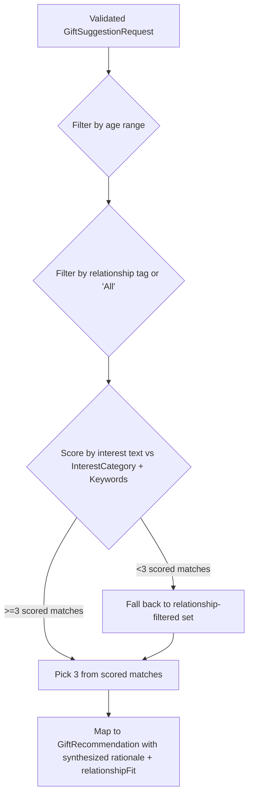

### Story 3.2: Catalog Matching Service

**BUILDID**: NO-CYCLE | **Epic**: 3 - CURATED GIFT CATALOG | **ID**: 3.2 | **Date**: 2026-09-18 | **Jira**: LOCAL | **GitHub**: LOCAL | **AzureDevOps**: LOCAL
**Wave**: 6
**Requires**: [3.1]
**Enables**: [3.3]
**Files Touched**:
  - src/infrastructure/catalog/CatalogRecommendationProvider.ts
**Roles Ref**: docs/requirements.md#roles--permissions-matrix — personas this story differentiates: single-actor — no role variation
**QA Candidate**: Yes — **Observable:** given the same age/relationship/interests input, the provider returns exactly three catalog-sourced gift ideas relevant to that input. **Mechanism:** in-memory filter-then-score over the 150-entry catalog, following the age → relationship → interest-score → fallback sequence documented in the source spreadsheet. **Authz & preconditions:** single-user app, no RBAC; matching is a pure function of validated input plus the static catalog, no external state. **Edge/idempotency:** identical input always yields a candidate set of the same size and composition (random pick among ties may vary the exact 3, which is expected); an input matching very few or zero interest keywords still returns exactly three by falling back to the relationship-filtered set. **Regression:** verifies the recommendation contract (`RecommendationProvider.generate`) stays satisfied by a non-AI implementation, so `RecommendationService`'s validation/error-mapping/exactly-three enforcement needs no changes.

#### 👤 User Reference

**Description**:
This story is what actually picks which three gift ideas a user sees. It takes the age, relationship, and interests the user typed in and searches the curated catalog from Story 3.1 for the best-fitting matches, using the same logic the catalog's creator documented alongside the data: first narrow by whether the gift suits the recipient's age, then by whether it suits the stated relationship, then by whether it relates to the stated interests — and if that last, most specific narrowing leaves too few options, it backs off to the relationship-narrowed set so the user still always gets three ideas.

**Acceptance Criteria**:
- For a valid, complete request, exactly three catalog gift ideas are returned.
- The three ideas are appropriate for the recipient's age (each falls within its own listed age range) and, where any catalog entries are relationship-specific, for the stated relationship.
- When there are enough interest-relevant matches, all three reflect the entered interests; when there are not enough, the app still returns three relevant-by-age-and-relationship ideas rather than fewer than three or an error.
- Each returned idea includes a short explanation of why it fits (a rationale) and a note on who it suits (relationship fit), even though the catalog does not store those as separate columns.

**User Journey**:
- **Entry**: the user has already filled in and submitted the gift form (unchanged from Story 2.3).
- **Load**: the same `/api/gift-suggestions` request now resolves against the catalog rather than waiting on an external AI call.
- **Render**: the same three-card results experience appears, faster and without any "AI thinking" delay, since matching is instant in-memory work.
- **Interact**: unchanged — retry, loading state, and error state all keep working exactly as before.
- **Empty/error**: this story guarantees three results whenever the input itself is valid, so the empty/error states from Story 2.3 remain reachable only through invalid input or a genuine server error, never through "the catalog ran out of ideas."
- **Responsive**: matching is a synchronous, in-memory computation over 150 rows, so response time is dominated by request handling, not "thinking."



#### 🤖 AI Agent Reference

**Must Read**:
- `docs/requirements.md` - updated Technical Constraints (catalog-based matching)
- `src/domain/services/RecommendationService.ts` - the `RecommendationProvider` interface this class must implement, and the exactly-three/field validation this service already performs on whatever the provider returns
- `src/infrastructure/catalog/giftCatalogLoader.ts` (Story 3.1) - the typed catalog this service queries
- The source spreadsheet's documented "Suggested matching logic for 'give me 3 gift ideas'" (already reviewed): (1) filter `MinRecipientAge <= age <= MaxRecipientAge`; (2) keep rows where `RelationshipTags` contains the entered relationship OR equals `All`; (3) score remaining rows by case-insensitive partial match of the entered interest text against `InterestCategory` and `Keywords`, keeping only rows with at least one match; (4) if step 3 leaves fewer than 3 rows, fall back to the step-2 result (ignore the interest filter); (5) pick 3 from the remaining candidates.

**Description**:
Implement `CatalogRecommendationProvider`, a class satisfying the existing `RecommendationProvider` interface (`generate(input): Promise<unknown>`) so it is a drop-in replacement for `ClaudeRecommendationClient` with zero changes required to `RecommendationService`'s validation, error-mapping, or exactly-three enforcement. The provider runs the age → relationship → interest-score → fallback algorithm above, then maps the chosen 3 catalog entries into the existing `GiftRecommendation` shape, synthesizing `rationale` and `relationshipFit` text from the catalog fields (since the spreadsheet does not store these as separate columns).

**Acceptance Criteria**:
- `CatalogRecommendationProvider.generate(input)` returns a `Promise` resolving to an array of exactly 3 objects, each satisfying the existing `GiftRecommendation` contract (`id`, `title`, `description`, `rationale`, `priceRange`, `relationshipFit`, optional `productUrl`).
- Age filtering is inclusive on both bounds (`minRecipientAge <= input.recipientAge <= maxRecipientAge`).
- Relationship filtering keeps an entry if its `relationshipTags` includes the input relationship OR includes `All`.
- Interest scoring is case-insensitive and matches if the entered interests text contains (or is contained by) any token in `interestCategory` or `keywords`; entries with zero matches are excluded at this stage only.
- If the interest-scored set has fewer than 3 entries, the provider falls back to the full relationship-filtered set (ignoring the interest filter) so exactly 3 can still be chosen — this fallback is unconditional and never surfaces an error to the caller.
- `productUrl` is always omitted (the catalog has no product-link column); this is valid per the existing optional field and existing trusted-domain handling in `RecommendationService`/`GiftResults` (no code change needed there).
- `rationale` is a synthesized sentence referencing the matched interest category/keyword (or the relationship, when the fallback path was used) — never a hardcoded generic string repeated identically across all three results in a way that looks copy-pasted.
- `relationshipFit` is a synthesized short phrase derived from the entry's `relationshipTags` (e.g. "A good fit for a **Friend**" or, for `All`, a relationship-agnostic phrasing).
- Selection among tied/equally-scored candidates is randomized (not always the same first 3 rows in file order), verified by a test that seeds/observes variation across repeated calls with the same input.

**RBAC Enforcement**:
No role-differentiated access — single actor.

**System responses + error cases**:

| Trigger | Response | Side-effect |
|---------|----------|-------------|
| Valid input, ≥3 interest-scored matches | 3 catalog entries mapped to `GiftRecommendation[]`, resolved promise | none |
| Valid input, <3 interest-scored matches | Falls back to relationship-filtered set; still 3 results | none |
| Valid input, catalog has fewer than 3 age+relationship-eligible entries at all (defensive case; does not occur with the current 150-row dataset given its coverage) | Provider throws a typed error the existing `RecommendationService`/`toErrorResponse` mapping already handles as a safe 500 | logged via existing `RecommendationServiceError` path, no new error type needed |
| Repeat identical request | New random 3-of-N pick each time (or same 3, if N==3); no persistent state created | none |

**QA-observable behaviour**:
- For a fixed input whose interests clearly match a catalog category (e.g. "music"), all 3 returned titles relate to that category or, when repeated many times, the vast majority do (random tie-breaking is expected among equally-scored candidates).
- For an input with nonsense/no-match interests (e.g. "xyzzyx123"), exactly 3 results are still returned, age- and relationship-appropriate, via the fallback path.
- For a boundary age exactly equal to a catalog entry's `MinRecipientAge` or `MaxRecipientAge`, that entry is eligible (inclusive bounds verified).
- **What does NOT change**: the API contract, exactly-three enforcement, and error-response shape are identical to the AI-backed implementation — this is purely a provider swap.

**Prerequisites**: Story 3.1 complete.

**Context**: `src/domain/services/RecommendationService.ts`, `src/infrastructure/catalog/giftCatalogLoader.ts`, `src/domain/entities/GiftRecommendation.ts`

**Patterns**: Provider/adapter substitution behind an existing interface (Dependency Inversion — `RecommendationService` depends on the `RecommendationProvider` abstraction, not a concrete implementation) - See `docs/architecture/design/01-patterns-and-standards-greenfield.md`

**Steps**:
1. Implement the filter pipeline (age → relationship → interest score) as small, independently testable functions.
   ```ts
   function isAgeEligible(entry: GiftCatalogEntry, age: number): boolean {
     return age >= entry.minRecipientAge && age <= entry.maxRecipientAge;
   }

   function isRelationshipEligible(entry: GiftCatalogEntry, relationship: string): boolean {
     return entry.relationshipTags.includes('All') || entry.relationshipTags.includes(relationship);
   }
   ```
2. Implement interest scoring (case-insensitive partial match against `interestCategory` + `keywords`) and the <3 fallback to the relationship-filtered set.
3. Implement random selection of 3 from the final candidate set (`Math.random`-based shuffle-and-slice, or equivalent), and map each chosen entry to `GiftRecommendation`, synthesizing `rationale` and `relationshipFit`.
4. Implement `CatalogRecommendationProvider implements RecommendationProvider` wrapping the pipeline in an async `generate(input)` method (synchronous work wrapped in a resolved Promise to satisfy the existing interface).

**Tests**:
```ts
describe('CatalogRecommendationProvider', () => {
  it('returns exactly three recommendations for a valid request', async () => {
    const provider = new CatalogRecommendationProvider();
    await expect(provider.generate(validInput)).resolves.toHaveLength(3);
  });

  it('falls back to the relationship-filtered set when interests match nothing', async () => {
    const provider = new CatalogRecommendationProvider();
    const result = await provider.generate({ ...validInput, interests: 'xyzzyx123nomatch' });
    expect(result).toHaveLength(3);
  });

  it('only returns entries within the recipient age range, inclusive of the boundary', async () => {
    // assert against known catalog fixtures at the exact min/max boundary
  });

  it('never includes a relationship-ineligible entry', async () => {
    // assert every returned entry's source relationshipTags include the input relationship or "All"
  });
});
```

Manual: Submit the form with interests matching a real catalog category (e.g. "gardening") and confirm the three results are thematically relevant; submit with nonsense interests and confirm three (still age/relationship-appropriate) results still appear.

**Quality**: ESLint 0 errors, tests pass, coverage ≥85% for the matching pipeline and provider, no console errors.

**OUT**: ❌ Not wiring this provider into the live API route yet — that is Story 3.3. ❌ Not adding budget-based filtering or scoring (confirmed: budget stays validated/displayed only, matching the source spreadsheet's own documented algorithm).

**Evidence**: Passing unit tests covering age boundaries, relationship filtering, interest scoring, and the <3 fallback path; coverage report.
