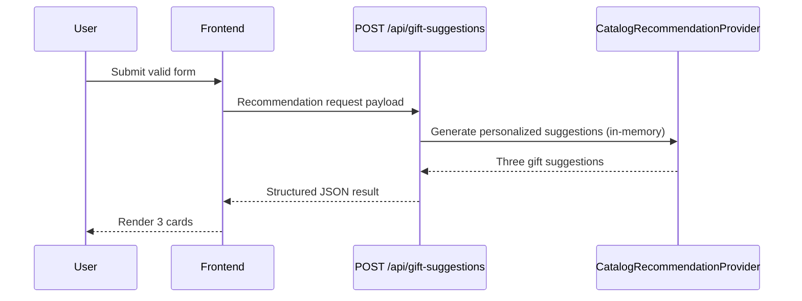

### Story 3.3: Wire In Catalog Provider & Retire the AI Adapter

**BUILDID**: NO-CYCLE | **Epic**: 3 - CURATED GIFT CATALOG | **ID**: 3.3 | **Date**: 2026-09-18 | **Jira**: LOCAL | **GitHub**: LOCAL | **AzureDevOps**: LOCAL
**Wave**: 7
**Requires**: [3.2]
**Enables**: []
**Files Touched**:
  - src/app/api/gift-suggestions/handler.ts
  - src/infrastructure/ai/ClaudeRecommendationClient.ts
  - .env.example
**Roles Ref**: docs/requirements.md#roles--permissions-matrix — personas this story differentiates: single-actor — no role variation
**QA Candidate**: Yes — **Observable:** `POST /api/gift-suggestions` returns catalog-backed recommendations with no `CLAUDE_API_KEY` configured, and no request to any external AI endpoint ever occurs. **Mechanism:** the route's default provider is swapped from `ClaudeRecommendationClient` to `CatalogRecommendationProvider`. **Authz & preconditions:** single-user app, no RBAC; no change to who can call the endpoint. **Edge/idempotency:** the rate limiter and body-size cap (still relevant, general abuse controls) continue to apply; the provider-timeout/`AbortController` and concurrency-limiter code (whose sole purpose was bounding a slow, paid external call) are retired since matching is now synchronous, in-memory, and free. **Regression:** every existing HIGH-001 abuse-control test that is not provider-latency-specific must still pass unchanged; provider-timeout-specific tests are removed, not left silently broken.

#### 👤 User Reference

**Description**:
This story flips the switch: it's the change that makes the app actually use the curated catalog instead of calling out to an AI service. From the user's point of view nothing about the form or the results screen changes — same fields, same three-card layout — but the app no longer depends on an external AI provider or its API key at all, and answers come back instantly.

**Acceptance Criteria**:
- Submitting the form returns three relevant gift ideas without any `CLAUDE_API_KEY` (or any Claude-related environment variable) configured.
- No network call to any external AI service happens as part of generating a recommendation.
- Everything that already worked (loading state, error state, retry, duplicate-submit prevention, exactly-three rendering) keeps working unchanged.

**User Journey**:
- **Entry**: unchanged — the user fills out and submits the same form.
- **Load**: the request resolves faster than before, since there is no external network round-trip.
- **Render**: unchanged three-card results.
- **Interact**: unchanged retry/duplicate-submit behavior.
- **Empty/error**: unchanged safe-error contract for invalid input, rate limiting, and oversized requests; the specific "provider timed out" / "provider rate limited" error paths tied to the old AI adapter are removed since there is no longer an external provider to time out or rate-limit against.
- **Responsive**: faster than the AI-backed version, since matching is in-memory.



#### 🤖 AI Agent Reference

**Must Read**:
- `docs/requirements.md` - updated Technical Constraints (catalog-based matching, no external AI call)
- `src/app/api/gift-suggestions/handler.ts` - current default-provider wiring, rate limiter, concurrency limiter, and body-size cap (HIGH-001 remediation, `docs/reviews/all-stories-code-review-v1.md`)
- `src/infrastructure/ai/ClaudeRecommendationClient.ts` - the adapter being retired, including its `AbortController` timeout logic
- `docs/reviews/all-stories-code-review-v1.md` / `v2.md` / `v3.md` - the abuse-control rationale and its documented limitations (rate limiter is a best-effort, single-process MVP mitigation; this remains true and unaffected by this story)

**Description**:
Swap `createGiftSuggestionsHandler`'s default `provider` from `new ClaudeRecommendationClient()` to `new CatalogRecommendationProvider()`. Remove `ClaudeRecommendationClient.ts` and its dedicated tests, since no code path constructs it anymore. Remove the concurrency limiter and its wiring from the handler — its sole purpose (bounding in-flight calls to a slow, paid external API to protect provider budget and avoid resource exhaustion from hung requests) no longer applies to a synchronous, free, in-memory operation. Keep the per-client rate limiter and the request-body-size cap: both remain valid, provider-independent abuse controls (a request flood or an oversized payload is still worth rejecting regardless of what generates the response). Remove the now-unused Claude-specific environment variables from `.env.example`.

**Acceptance Criteria**:
- `createGiftSuggestionsHandler`'s default `provider` parameter constructs `CatalogRecommendationProvider`, not `ClaudeRecommendationClient`.
- `src/infrastructure/ai/ClaudeRecommendationClient.ts` and its dedicated test cases are deleted (not left dead/unreferenced).
- The concurrency limiter (`ConcurrencyLimiter`, `acquiredConcurrencySlot` tracking, the `SERVICE_BUSY` path) is removed from `handler.ts`; `ServiceBusyError` is removed from `src/lib/errors.ts` if nothing else references it.
- The rate limiter (`FixedWindowRateLimiter`, `x-real-ip`/`X-Forwarded-For` key derivation, `RATE_LIMITED` + `Retry-After`) and the body-size cap (`readBoundedJson`, `PAYLOAD_TOO_LARGE`) are unchanged and still enforced.
- `.env.example` no longer lists `CLAUDE_API_KEY`, `CLAUDE_API_URL`, `CLAUDE_MODEL`, or `CLAUDE_REQUEST_TIMEOUT_MS`.
- `TRUSTED_PRODUCT_DOMAINS` stays in `.env.example` (still relevant defense-in-depth for the optional `productUrl` field, even though the catalog currently never populates one).
- A fresh `npm run build && npm run start` with no `.env` file present returns real three-card recommendations for a valid request (proving the app no longer depends on any Claude configuration).

**RBAC Enforcement**:
No role-differentiated access — single actor.

**System responses + error cases**:

| Trigger | Response | Side-effect |
|---------|----------|-------------|
| Valid submission | `200` + three catalog-backed recommendations | UI receives structured result, no external network call made |
| Invalid request | `400` validation error (unchanged) | no catalog lookup |
| Rate limit exceeded | `429` + `Retry-After` (unchanged) | no catalog lookup |
| Oversized body | `413` (unchanged) | no catalog lookup |
| Repeat same submission | Independent successful responses; no duplicate writes | no persistent side effect |

**QA-observable behaviour**:
- The API returns exactly three entries for valid requests with no `CLAUDE_API_KEY` present anywhere in the environment.
- `grep`-level check: no reference to `ClaudeRecommendationClient`, `CLAUDE_API_KEY`, or `anthropic.com` remains in `src/` outside historical docs/reviews.
- Existing rate-limit and body-size-cap tests (HIGH-001 regression coverage) still pass unmodified.
- **What does NOT change**: the request/response JSON contract, the validation rules, and the rate-limit/body-cap abuse controls.

**Prerequisites**: Story 3.2 complete.

**Context**: `src/app/api/gift-suggestions/handler.ts`, `src/infrastructure/catalog/CatalogRecommendationProvider.ts`, `docs/reviews/all-stories-code-review-v1.md`

**Patterns**: Dependency Inversion / adapter substitution - See `docs/architecture/design/01-patterns-and-standards-greenfield.md`

**Steps**:
1. Update `handler.ts`'s default `provider` to `new CatalogRecommendationProvider()`; remove the `ConcurrencyLimiter` import, default instance, dependency, and the `acquiredConcurrencySlot`/`finally`-release logic.
2. Delete `src/infrastructure/ai/ClaudeRecommendationClient.ts` and its dedicated test cases; remove any now-unused imports (`ProviderTimeoutError`, `ProviderConfigurationError`, `ProviderRateLimitError` — keep only the error types still reachable from the catalog path and the existing validation/rate-limit/body-cap paths).
3. Remove `ServiceBusyError` from `src/lib/errors.ts` if the concurrency-limiter removal leaves it with no remaining reference.
4. Update `.env.example` to drop the Claude-specific variables, keeping `TRUSTED_PRODUCT_DOMAINS`.
5. Re-run the full suite, lint, typecheck, and a real `npm run build && npm run start` smoke test with no `.env` file present.

**Tests**:
```ts
describe('POST /api/gift-suggestions (catalog-backed)', () => {
  it('returns exactly three recommendations with no CLAUDE_API_KEY configured', async () => {
    const handler = createGiftSuggestionsHandler();
    const response = await handler(request(validInput));
    expect(response.status).toBe(200);
    expect((await response.json()).recommendations).toHaveLength(3);
  });

  it('still rate-limits a client that exhausts its request budget', async () => {
    // existing HIGH-001 rate-limit test, re-run unmodified against the catalog-backed handler
  });

  it('still rejects an oversized request body', async () => {
    // existing HIGH-001 body-cap test, re-run unmodified
  });
});
```

Manual: Delete/rename `.env` locally, run `npm run build && npm run start`, submit the form, and confirm real three-card results with zero references to Claude in the server logs.

**Quality**: ESLint 0 errors, tests pass, coverage ≥85%, no console errors, no dead/unused imports left behind by the adapter removal.

**OUT**: ❌ Not changing the rate limiter's client-key derivation or thresholds (out of scope; unrelated to the provider swap). ❌ Not addressing the previously-documented in-memory/serverless rate-limiter scaling limitation (still tracked separately per `docs/reviews/all-stories-code-review-v3.md`).

**Evidence**: Passing full test suite, lint/typecheck clean, and a real `npm run build && npm run start` transcript showing a successful recommendation response with no `.env` file present.
