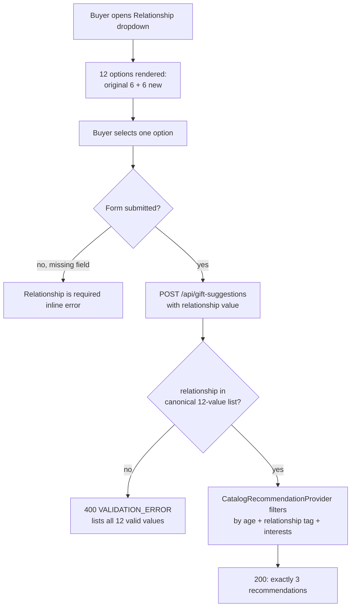

### Story 4.1: Expanded Relationship Options

**File**: `docs/plans/stories/epic-4-story-4.1-expanded-relationship-options.md`

**Epic**: 4 - EXPANDED RELATIONSHIP OPTIONS | **ID**: 4.1 | **Date**: 2026-09-22 | **Jira**: LOCAL
**Wave**: 1
**Requires**: []
**Enables**: []
**Files Touched**:
  - src/domain/entities/GiftRecommendation.ts
  - src/components/forms/GiftForm.tsx
  - src/tests/gift-input-validation.test.ts
  - src/tests/gift-form.test.tsx
  - src/tests/catalog-recommendation-provider.test.ts
  - src/tests/gift-suggestions-api.test.ts

**Roles Ref**: docs/requirements.md#roles--permissions-matrix — personas this story differentiates: single-actor — no role variation
**QA Candidate**: Yes — **Observable:** the relationship dropdown renders 12 options (the original 6 plus 6 new ones), and selecting any of the 6 new values and submitting a valid form still yields exactly 3 gift recommendations. **Mechanism:** `POST /api/gift-suggestions` validates `relationship` against the widened `RELATIONSHIPS` tuple in `validateGiftInput`; `CatalogRecommendationProvider.generate()` filters the static catalog by `relationshipTags.includes('All') || relationshipTags.includes(relationship)` — unchanged logic, wider accepted input domain. **Authz & preconditions:** none — this system has no authentication/authorization (single-actor); the only precondition is a syntactically valid request body. **Edge/idempotency:** an unsupported relationship string is rejected with the same `ValidationError` shape as today (message text now lists 12 values instead of 6); repeated identical requests each independently return 3 recommendations (stateless; the algorithm's random tie-break among candidates is pre-existing behavior, not introduced here). **Regression:** the existing 6 relationship values must continue to validate and match exactly as before; overall coverage must stay ≥85% (baseline 96.47%).

> _Depth exemplar reference: this rationale follows the same five-label structure as `IMPLEMENTATION_PLAN_FORMAT.md`'s worked example, adapted to a single-actor system with no RBAC._

---

#### 👤 User Reference

**Description**:
Right now, when someone uses the gift-suggestion form, the "Relationship" dropdown only offers six serious options: Friend, Partner, Parent, Child, Sibling, and Colleague. This story adds six more, more playful options — Mortal Enemy, Frenemy, Coworker I Tolerate, Secret Santa Victim, Boss I Need to Impress, and Person Whose Name I Forgot — so the tool can be used for lighthearted or awkward gifting situations too, not just close relationships. After this story, the dropdown shows all 12 options, and picking any of the new ones works exactly like picking an existing one: you still get exactly 3 gift suggestions back, matched by the recipient's age and your typed interests (the relationship field doesn't change *how* gifts are picked for the "All"-tagged catalog items that make up half the catalog — it just widens who you're allowed to say the gift is for). Nothing about the existing 6 relationships changes — they keep working exactly as they do today. As a smaller but important cleanup bundled into this same story, the form currently has its own private copy of the relationship list that duplicates a value defined elsewhere in the code; that duplicate copy is being removed so there's only one true list going forward, which is what makes it possible to add these 6 new options in a single place instead of two.

**Acceptance Criteria** (plain-English bullets):
- The Relationship dropdown shows 12 options in this order: Friend, Partner, Parent, Child, Sibling, Colleague, Mortal Enemy, Frenemy, Coworker I Tolerate, Secret Santa Victim, Boss I Need to Impress, Person Whose Name I Forgot.
- Selecting any of the 6 new options and filling in a valid age, budget, and interests still returns exactly 3 gift suggestions when submitted.
- Selecting any of the original 6 options still works exactly as it did before this change (no regression).
- If someone submits a relationship value that isn't one of the 12 (which shouldn't be possible through the dropdown, but is still checked on the backend), the error message names all 12 valid options.
- No visual redesign of the form — the dropdown just has more choices in it, using the same look and interaction as today.
- No gift catalog content changes — the same 150 gift ideas are used; none are added, removed, or specially tagged for the new relationship options.

**User Flow** — Role-agnostic but user-facing (single-actor RBAC; every user sees the same form and dropdown):

**User Journey** (no role variation — all users see the same view):
- **Entry**: the buyer opens the home page; the gift form renders with an empty, unselected Relationship dropdown.
- **Load**: opening the dropdown (click or keyboard) renders all 12 options in canonical order — no network request is involved, the list is static and bundled with the page.
- **Render**: each option's visible label matches its submitted value exactly (e.g. selecting "Secret Santa Victim" submits the string `"Secret Santa Victim"`, not an abbreviation or code).
- **Interact**: the buyer selects one of the 6 new options, fills in age/budget/interests, and submits — the same submit button and loading state ("Finding gift ideas...") behave identically regardless of which of the 12 relationships was chosen.
- **Empty/error**: if the buyer submits without picking a relationship, the existing "Relationship is required" inline error appears (unchanged behavior — the dropdown has no default valid selection, exactly as today).
- **Responsive**: the dropdown remains a native `<select>` element, so it inherits full keyboard/screen-reader/mobile-native-picker support automatically — no responsive-specific work needed for 12 options vs. 6.

**Flow Diagram**:



---

#### 🤖 AI Agent Reference

**Must Read**:
- `docs/architecture/design/02-target-architecture-brownfield.md` — the approved delta for this exact change (Delta Summary, Data Model Changes, API Changes sections)
- `docs/architecture/design/03-patterns-and-standards-brownfield.md` — UI Components/Shared Library pattern (the migration this story executes) and API Design Pattern

**Description**:
Widen the domain's canonical `RELATIONSHIPS` tuple from 6 to 12 values (append 6 new ones), and fix `GiftForm.tsx` to import that canonical tuple instead of maintaining its own hardcoded duplicate — closing the exact drift risk the deep-dive flagged (`docs/architecture/current/01-full-system-deep-dive.md`, UI Components / Shared Library finding). `validateGiftInput.ts` and `CatalogRecommendationProvider.ts` require **no code changes**: both already derive their behavior generically from `RELATIONSHIPS` / the input's relationship string, so the widened enum flows through automatically. No catalog data (`src/data/giftCatalog.json`) changes — per the approved target architecture, the 75 existing `"All"`-tagged entries (of 150) already guarantee enough relationship-eligible candidates for any of the 12 values.

**Acceptance Criteria** (comprehensive):
- `RELATIONSHIPS` in `src/domain/entities/GiftRecommendation.ts` contains exactly these 12 string literals, in this order: `'Friend', 'Partner', 'Parent', 'Child', 'Sibling', 'Colleague', 'Mortal Enemy', 'Frenemy', 'Coworker I Tolerate', 'Secret Santa Victim', 'Boss I Need to Impress', 'Person Whose Name I Forgot'`.
- `GiftForm.tsx` no longer declares its own `relationships` constant; it imports `RELATIONSHIPS` from `@/domain/entities/GiftRecommendation` and maps it to `<Select>` options exactly as the current code maps the local array (same `{ label, value }` shape).
- `validateGiftInput` accepts all 12 values with no code change (verified by test, not by inspection alone).
- `validateGiftInput`'s rejection message for an invalid relationship lists all 12 values (this is automatic since `RELATIONSHIP_MESSAGE` derives from `RELATIONSHIPS.join(', ')` — verify the exact string in a test rather than assuming).
- `CatalogRecommendationProvider.generate()` returns exactly 3 recommendations for each of the 6 new relationship values (verified against the real bundled catalog, not a fixture), across at least one representative age.
- The 6 original relationship values continue to validate and match exactly as before (regression-checked, not just re-run — assert equivalent behavior explicitly).
- `src/data/giftCatalog.json` is not modified by this story.
- No other file in `src/` references a hardcoded relationship list (grep-verified before marking this story done).
- Test coverage remains ≥85% project-wide (baseline: 96.47%).

**RBAC Enforcement**: No role-differentiated access — single actor.

**System responses + error cases**:

| Trigger | Response | Side-effect |
|---------|----------|-------------|
| `POST /api/gift-suggestions` with a new relationship value (e.g. `"Secret Santa Victim"`) + valid age/budget/interests | `200` + exactly 3 recommendations | none — stateless, read-only against the static catalog |
| `POST /api/gift-suggestions` with an original relationship value (e.g. `"Friend"`) | `200` + exactly 3 recommendations, unchanged from pre-story behavior | none |
| Repeat of the same successful call (idempotent) | `200`, independently computed 3 recommendations each time (random tie-break among equally-eligible candidates is pre-existing algorithm behavior, unrelated to this change) | none |
| `POST /api/gift-suggestions` with an unsupported relationship string (not one of the 12) | `400 {"error":{"code":"VALIDATION_ERROR","message":"Relationship must be one of: Friend, Partner, Parent, Child, Sibling, Colleague, Mortal Enemy, Frenemy, Coworker I Tolerate, Secret Santa Victim, Boss I Need to Impress, Person Whose Name I Forgot"}}` | none |
| `POST /api/gift-suggestions` with a missing `relationship` field | `400 {"error":{"code":"VALIDATION_ERROR","message":"Relationship is required"}}` (unchanged) | none |
| Rate limit exceeded (pre-existing behavior, unaffected by this story) | `429` + `Retry-After` header (unchanged) | none |

**QA-observable behaviour**:
- Rendering `<GiftForm />` produces exactly 12 `<option>` elements under the Relationship `<select>`, in canonical `RELATIONSHIPS` order, with visible text exactly matching each submitted value.
- For every one of the 12 relationship values, `new CatalogRecommendationProvider().generate(...)` against the real bundled catalog resolves to an array of length exactly 3 (spot-checked per new value, not exhaustively across all ages — the 75/150 `"All"`-tagged-entry guarantee established in the target architecture makes this a coverage sample, not a boundary search).
- `validateGiftInput({ ..., relationship: '<not one of the 12>' })` throws a `ValidationError` whose `.message` contains all 12 canonical values in `RELATIONSHIPS` order.
- **What does NOT change**: `src/data/giftCatalog.json` remains 150 entries (byte-identical); the API's success/error response shapes are unchanged; the original 6 relationships' matching results are unaffected; the budget field's non-use in matching is unaffected.

**Prerequisites**: None beyond the current shipped state of the codebase (Epics 1–3 complete, per `docs/status.md`). No other story in this plan is required first — this is a self-contained, root-independent story (`requires: []`).

**Context** (read before implementing):
- `src/domain/entities/GiftRecommendation.ts`
- `src/components/forms/GiftForm.tsx`
- `src/application/validation/validateGiftInput.ts` (read-only — confirms no change needed)
- `src/infrastructure/catalog/CatalogRecommendationProvider.ts` (read-only — confirms no change needed)
- `docs/architecture/design/02-target-architecture-brownfield.md`
- `docs/architecture/design/03-patterns-and-standards-brownfield.md`

**Patterns**: See `docs/architecture/design/03-patterns-and-standards-brownfield.md` — specifically **§7 UI Components / Shared Library Pattern** ([New adoption] — this story executes that migration) and **§5 API Design Pattern** ([Current — kept] — validation continues to derive from the single canonical `RELATIONSHIPS` source).

**Steps**:

1. Widen the canonical relationship list — the single source of truth every other layer derives from:
   ```typescript
   // src/domain/entities/GiftRecommendation.ts
   export const RELATIONSHIPS = [
     'Friend', 'Partner', 'Parent', 'Child', 'Sibling', 'Colleague',
     'Mortal Enemy', 'Frenemy', 'Coworker I Tolerate',
     'Secret Santa Victim', 'Boss I Need to Impress', 'Person Whose Name I Forgot',
   ] as const;

   export type Relationship = (typeof RELATIONSHIPS)[number];
   // GiftRecommendation / GiftRecommendationResponse types below are unchanged.
   ```
   No other change to this file. `Relationship` widens automatically via `typeof RELATIONSHIPS[number]`.

2. Fix `GiftForm.tsx` to import the canonical list instead of duplicating it — this closes the deep-dive's flagged tech debt:
   ```typescript
   // src/components/forms/GiftForm.tsx
   import { RELATIONSHIPS } from '@/domain/entities/GiftRecommendation';
   // DELETE the line below — it duplicated RELATIONSHIPS and is the tech debt this story closes:
   // const relationships = ['Friend', 'Partner', 'Parent', 'Child', 'Sibling', 'Colleague'] as const;
   ```
   Then update the `<Select>` usage to map from the import instead of the deleted local constant:
   ```typescript
   <Select
     id="relationship"
     label="Relationship"
     name="relationship"
     placeholder="Choose a relationship"
     options={RELATIONSHIPS.map((relationship) => ({ label: relationship, value: relationship }))}
     value={values.relationship}
     aria-invalid={Boolean(hasSubmitted && !values.relationship)}
     onChange={(event) => updateValue('relationship', event.target.value)}
   />
   ```
   No other code in `GiftForm.tsx` changes — `updateValue`, `getGiftFormError`, `submitGiftSuggestions`, and the rest of the render tree are relationship-value-agnostic already.

3. Confirm (do not modify) that `validateGiftInput.ts` and `CatalogRecommendationProvider.ts` need zero changes — both are already generic over `RELATIONSHIPS` / the relationship string. This is a verification step, not an implementation step; capture it as a code-review note rather than a diff.

4. Update `src/tests/gift-input-validation.test.ts` to cover the widened set:
   ```typescript
   import { RELATIONSHIPS } from '@/domain/entities/GiftRecommendation';
   // ...
   it('accepts every one of the 12 supported relationship values', () => {
     for (const relationship of RELATIONSHIPS) {
       expect(() => validateGiftInput({ ...validInput, relationship })).not.toThrow();
     }
   });

   it('rejects an unsupported relationship with a message listing all 12 values', () => {
     expect(() => validateGiftInput({ ...validInput, relationship: 'Coworker' })).toThrowError(
       new ValidationError(`Relationship must be one of: ${RELATIONSHIPS.join(', ')}`),
     );
   });
   ```
   Note: the existing test `'rejects an unsupported relationship before provider code can receive it'` hardcodes the old 6-value message string — update it to build the expected message from `RELATIONSHIPS.join(', ')` (as above) instead of a hardcoded 6-value string, so it can't silently pass against a stale expectation.

5. Update `src/tests/gift-form.test.tsx`'s existing `'includes every supported relationship option'` test to assert against the canonical list instead of a hardcoded array:
   ```typescript
   import { RELATIONSHIPS } from '@/domain/entities/GiftRecommendation';
   // ...
   it('includes every supported relationship option', () => {
     const markup = renderToStaticMarkup(<GiftForm />);
     for (const relationship of RELATIONSHIPS) {
       expect(markup).toContain(`>${relationship}</option>`);
     }
   });
   ```

6. Add coverage in `src/tests/catalog-recommendation-provider.test.ts` (inside the existing `'CatalogRecommendationProvider (default constructor, real catalog)'` describe block) proving the new values still yield 3 recommendations against the real bundled catalog:
   ```typescript
   it.each([
     'Mortal Enemy', 'Frenemy', 'Coworker I Tolerate',
     'Secret Santa Victim', 'Boss I Need to Impress', 'Person Whose Name I Forgot',
   ])('still returns exactly three recommendations for the new relationship value "%s"', async (relationship) => {
     const provider = new CatalogRecommendationProvider();
     const result = await provider.generate({ ...validInput, relationship, interests: 'nomatch-xyz-check-all-fallback' });
     expect(result).toHaveLength(3);
   });
   ```
   (`relationship` is passed as a plain string literal from the `it.each` array — TypeScript accepts it directly since these 6 strings are now part of the widened `Relationship` union after Step 1.)

7. Add one end-to-end case in `src/tests/gift-suggestions-api.test.ts` exercising the real route/handler with a new relationship value, alongside the existing `'returns exactly three validated recommendations for a valid request'` test:
   ```typescript
   it('accepts a newly added relationship value end-to-end through the real handler', async () => {
     const provider = providerReturning(recommendations());
     const handler = createTestHandler({ provider });
     const response = await handler(request({ ...validInput, relationship: 'Secret Santa Victim' }));
     expect(response.status).toBe(200);
     const body = await response.json();
     expect(body.recommendations).toHaveLength(3);
   });
   ```

**Tests**:

```typescript
// src/tests/gift-input-validation.test.ts — new/updated cases
describe('validateGiftInput — relationship enum (Story 4.1)', () => {
  it('accepts every one of the 12 supported relationship values', () => {
    for (const relationship of RELATIONSHIPS) {
      expect(() => validateGiftInput({ ...validInput, relationship })).not.toThrow();
    }
  });

  it('rejects an unsupported relationship with a message listing all 12 values', () => {
    expect(() => validateGiftInput({ ...validInput, relationship: 'Coworker' })).toThrowError(
      new ValidationError(`Relationship must be one of: ${RELATIONSHIPS.join(', ')}`),
    );
  });
});
```

Manual:
1. Open the app locally (`npm run dev`), open the Relationship dropdown, and visually confirm all 12 options appear in the documented order.
2. Select "Secret Santa Victim" (or any new option), fill in a valid age/budget/interests, submit, and confirm exactly 3 recommendation cards render.
3. Repeat step 2 for "Friend" (an original option) to confirm no regression.
4. With browser dev tools, submit a request with `relationship: "Coworker"` directly against `/api/gift-suggestions` and confirm the 400 response lists all 12 values.

**Quality**: ESLint 0 errors, full suite passing (target: 134/134 or more), coverage ≥85% (baseline 96.47% — should not regress), no console errors during manual verification, `grep -rn "'Friend', 'Partner'" src/` returns only `GiftRecommendation.ts` (proves no duplicate list survives).

**OUT**:
- ❌ Adding, removing, or tagging any `src/data/giftCatalog.json` entries for the new relationships
- ❌ Reordering, renaming, or removing any of the original 6 relationship values
- ❌ Any visual/UX redesign of the form beyond the widened option list
- ❌ Any authentication/authorization work (none exists, none is being added)
- ❌ Localization/i18n of the relationship labels

**Evidence**: full test run output (pass count + coverage summary), a screenshot or copied markup snippet of the rendered 12-option dropdown, and the `grep` output proving no duplicate relationship list remains in `src/`.

---

## Quality Gates

**Per Story**: Patterns followed (canonical-source consolidation), tests pass, ESLint 0, AC met, self-review against the Depth Gate.
**Per Epic**: Single-story epic — epic-level and story-level completion are the same gate here.
**Final**: Dropdown shows 12 options; all 12 validate and match correctly; no regression in the original 6; coverage ≥85%.

---

## Risks

| Risk | Impact | Mitigation |
|------|--------|------------|
| A future change reintroduces a second hardcoded relationship list elsewhere in the codebase | Medium | This story's `grep`-verified quality check catches it at completion time; the patterns doc documents the single-canonical-source rule for future reviewers |
| A new relationship value happens to combine with a narrow age range to yield <3 candidates | Low | Mitigated by design — 75/150 catalog entries are relationship-agnostic (`"All"`-tagged), verified in the target architecture before this story was written; `CatalogRecommendationProvider` already throws a clear `RecommendationServiceError` (pre-existing behavior) rather than silently returning fewer than 3 |
